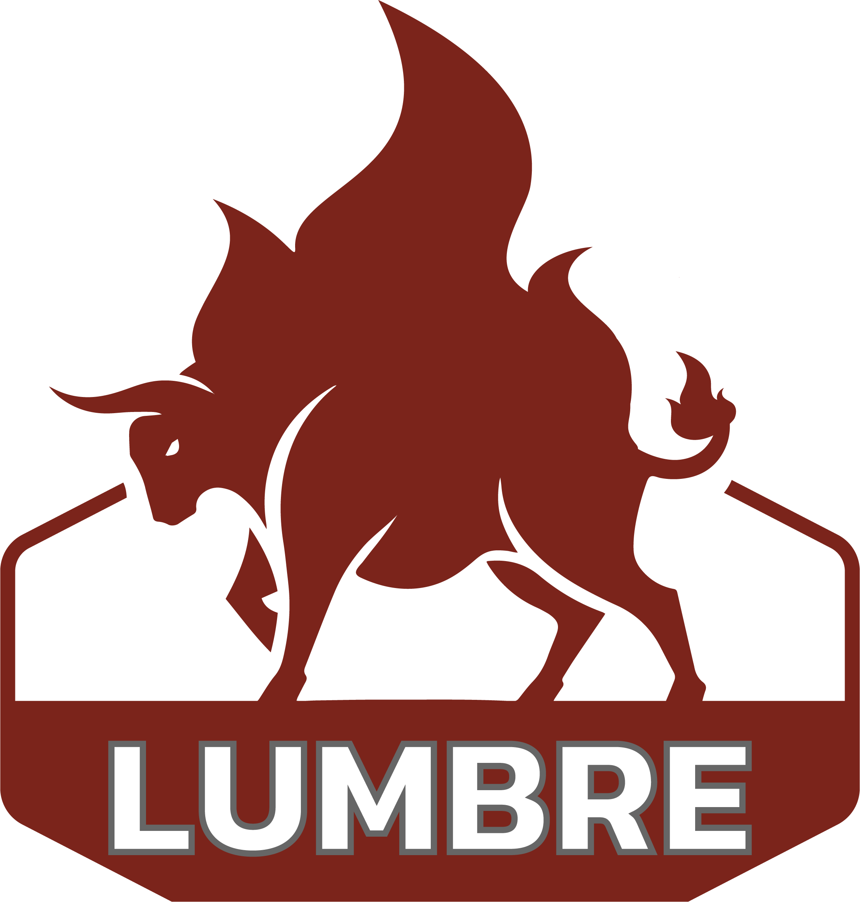
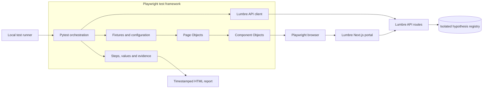
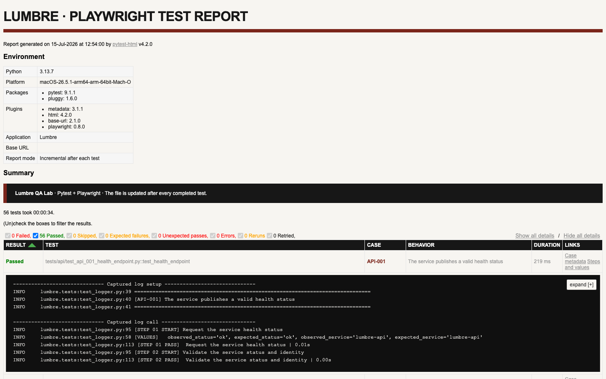

<p align="center">
  
</p>

# Lumbre Quality Engineering Lab

An end-to-end quality engineering portfolio project built with **Python,
Pytest, and Playwright**. The repository includes both the system under test—a
Next.js portal and API for Mexican outdoor-fire cooking—and the automation
framework used to validate it.

Lumbre demonstrates test architecture, Page Object Model, Component Objects,
API contracts, browser-network control, deterministic test data, cross-browser
validation, diagnostic reporting, and risk-based test strategy in one runnable
project.

> The product experience is written in Mexican Spanish as part of the Lumbre
> identity. Framework code and engineering documentation are written in English.

## Validated engineering baseline

| Signal | Current result |
| --- | ---: |
| Committed functional risks | 50 |
| Automated functional risks | 50 |
| Pytest executions | 56 |
| Test files | 46 |
| API cases / executions | 20 / 22 |
| Browser cases / executions | 30 / 34 |
| Supported browser engines | Chromium, Firefox, WebKit |
| API route-operation coverage | 91.7% (11/12) |
| Latest full-suite result | 56 passed |

**100% refers to the repository's 50-item committed functional-risk catalog.**
It is not a source-code line-coverage claim. Parameterized variants do not
inflate the risk-coverage calculation.

## Why this project exists

The project was designed to make a transition from Selenium + TypeScript to
Playwright + Python observable through working software. It provides:

- a realistic portal with UI workflows and API contracts;
- a maintainable automation framework instead of isolated demo scripts;
- explicit test steps, observed values, screenshots, traces, and HTML reports;
- examples of Playwright-specific capabilities such as web-first assertions,
  locators, request/response observation, routing, and multi-engine execution;
- written strategy that connects every automated case to a product risk.

## System under test

Lumbre is a cooking-at-the-fire portal with:

- recipes, products, events, membership, cart, and fire planning;
- a researched ingredient catalog grouped by flavor family;
- an experiment bench supporting formulas of up to six components;
- technical hypotheses for beef crust, bark, chicken, and vegetables;
- duplicate-formula detection and persisted repetition counters;
- JSON APIs used directly by API tests and indirectly by UI workflows.

## Architecture at a glance



Page Objects own page-level navigation and composition. Component Objects own
bounded widgets such as membership, cart, events, fire planning, and the
ingredient laboratory. Tests express behavior and assertions without leaking
selectors into the test body.

See [Architecture and design decisions](docs/ARCHITECTURE.md) for component
ownership, execution flows, isolation, and trade-offs.

## Repository layout

```text
lumbre-playwright-python/
├── portal/                 Next.js product UI, API routes, and JSON data
├── test-framework/
│   ├── framework/
│   │   ├── api/            APIRequestContext client
│   │   ├── components/     Reusable Component Objects
│   │   ├── pages/          Page Objects
│   │   └── reporting/      Logs, screenshots, metadata, and HTML hooks
│   └── tests/
│       ├── api/            API contracts and persistence behavior
│       └── ui/             UI, network, responsive, and browser coverage
├── docs/                   Strategy, architecture, notes, and exercises
├── scripts/                Local orchestration and report generation
└── .vscode/                Playwright/Python learning snippets
```

## Quality-engineering highlights

### Maintainable UI automation

- Accessible locators such as `get_by_role()` and `get_by_label()`.
- Playwright web-first assertions instead of arbitrary sleeps.
- Page Objects for page responsibilities and Component Objects for widgets.
- One behavior or closely related parameterized contract family per file.
- No application selectors duplicated across test bodies.

### API and integration coverage

- Positive and negative contracts through `APIRequestContext`.
- Filtering, malformed payloads, resource creation, and `404` contracts.
- Hypothesis validation, canonical signatures, deduplication, and persistence.
- Browser-to-API payload validation with `page.expect_request()`.
- Response observation with `page.expect_response()`.
- Controlled HTTP failures with `page.route()` and `route.fulfill()`.

### Diagnostics and evidence

- Human-readable test case ID and behavior metadata.
- Step-by-step console logs with obtained and expected values.
- A viewport screenshot after every completed UI step.
- Full-page screenshot and Playwright trace on UI failure.
- Self-contained HTML reports archived with a timestamp after every run.

## Featured engineering stories

### A test exposed a real frontend race

`UI-025` failed only when the suite ran with visible browser delays. A previous
toast timer was clearing the newer checkout confirmation. The test revealed a
state-management race; the portal was corrected to cancel the stale timer
before scheduling a new one.

### Network behavior is tested at the correct boundary

`UI-014` observes the membership request before validating the frontend result.
`ERR-001` replaces the server response with HTTP 500 and proves that the form
remains recoverable. These tests validate transport behavior without coupling
the Page Object to network implementation details.

### Persistent duplicate behavior remains deterministic

Hypothesis tests verify canonical ingredient signatures, formula reuse, and
counter persistence. The local runner copies seed JSON into a temporary
registry, so test execution never mutates the repository's source data.

Read the complete design decisions and outcomes in
[Engineering case studies](docs/ENGINEERING_CASE_STUDIES.md).

## Prerequisites

- Node.js `>=22.13.0`
- Python `>=3.11`
- macOS or Linux supported by Playwright

## One-time setup

Install the portal:

```bash
cd portal
npm ci
cd ..
```

Install the automation framework:

```bash
cd test-framework
python3 -m venv .venv
source .venv/bin/activate
pip install -e '.[dev]'
playwright install chromium firefox webkit
cp .env.example .env
cd ..
```

## Run the project

Run the full isolated suite. The script starts the portal on port `3100`,
copies hypothesis data into a temporary registry, runs Pytest, archives the
report, and shuts the temporary server down.

```bash
./scripts/test-local.sh -q
```

Useful focused commands:

```bash
# API suite
./scripts/test-local.sh -q -m api

# UI suite with a visible browser
./scripts/test-local.sh -q -m ui --headed --slowmo 500

# One case file
./scripts/test-local.sh -q \
  tests/ui/test_ui_018_existing_formula_reuses_hypothesis.py
```

Run static quality checks:

```bash
cd test-framework
.venv/bin/ruff format --check .
.venv/bin/ruff check .
.venv/bin/mypy framework tests
```

## Reports and failure analysis

### Portfolio report preview



The versioned preview shows the full-suite summary, environment, case metadata,
behavior, and structured logs. It provides portfolio evidence without adding a
large generated HTML artifact to Git.

Every normal run produces:

```text
test-framework/reports/runs/lumbre-report-YYYY-MM-DD_HH-MM-SS.html
```

The most recent execution is also copied to:

```text
test-framework/reports/lumbre-report.html
```

Open it on macOS with:

```bash
open test-framework/reports/lumbre-report.html
```

Generated reports are intentionally ignored by Git because a full
self-contained report includes embedded screenshots and can exceed 20 MB. The
PNG preview is the committed portfolio artifact; timestamped interactive HTML
reports remain local until CI artifact publishing is introduced.

## Test strategy and traceability

The suite is organized around product risk rather than test count. Each test
uses a stable marker such as `API-012`, `UI-018`, `BROWSER-001`, or `ERR-001`.
The risk catalog records priority, layer, intended behavior, and automation
status.

- [Test strategy and complete catalog](docs/TEST_STRATEGY.md)
- [Engineering case studies](docs/ENGINEERING_CASE_STUDIES.md)
- [Architecture and design decisions](docs/ARCHITECTURE.md)
- [Key Playwright notes](docs/KEY_PLAYWRIGHT_NOTES.md)
- [Playwright Python snippets](docs/PLAYWRIGHT_PYTHON_SNIPPETS.md)
- [Framework reference](test-framework/README.md)
- [Portal reference](portal/README.md)

## Current scope

The repository currently optimizes for deterministic local execution. A public
portal deployment and CI artifact publishing are natural next steps; they are
not presented as completed capabilities here.

## Author

Built by [Isaac Arellano](https://github.com/zvasdfg) as a practical quality
engineering and Playwright portfolio project.
