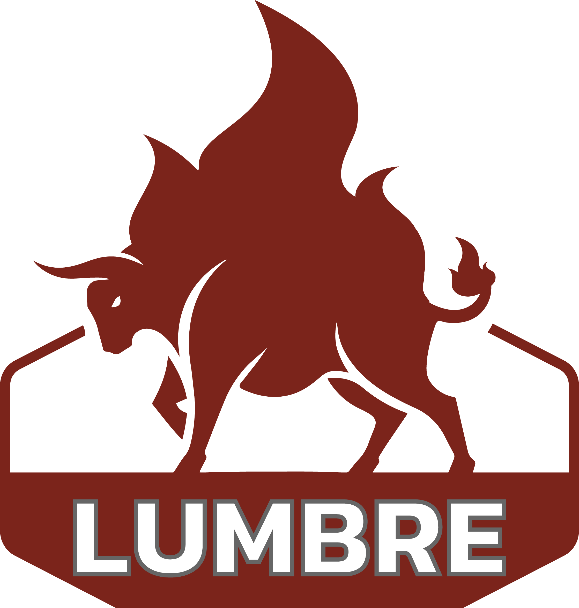
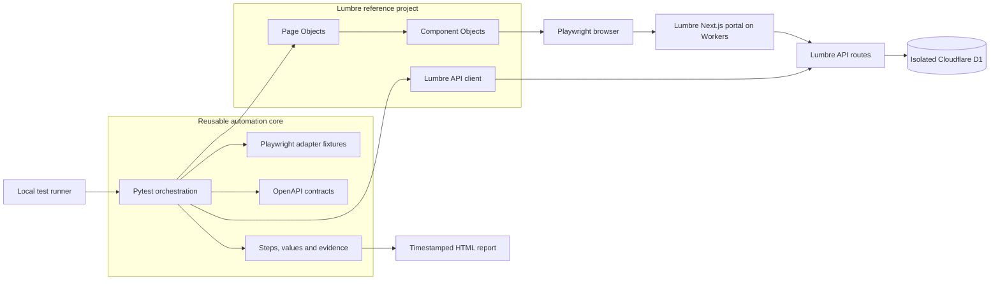
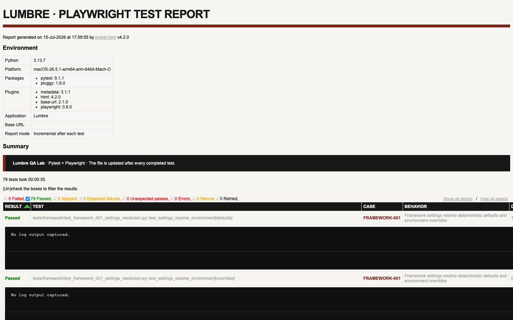

<p align="center">
  
</p>

# Playwright Python Automation Framework

Reusable quality-engineering portfolio framework built with **Python, Pytest,
and Playwright**. Lumbre, a Next.js portal and API for Mexican outdoor-fire
cooking, is the reference system under test and demonstrates how a product
project consumes the independent automation core.

The framework demonstrates project isolation, Page Object Model, Component
Objects, API contracts, browser-network control, deterministic test data,
cross-browser validation, diagnostic reporting, and risk-based test strategy.

> The product experience is written in Mexican Spanish as part of the Lumbre
> identity. Framework code and engineering documentation are written in English.

## Validated engineering baseline

| Signal | Current result |
| --- | ---: |
| Committed functional risks | 128 |
| Automated functional risks | 128 |
| Pytest executions | 164 |
| Test files | 127 |
| API cases / executions | 75 / 99 |
| Browser cases / executions | 53 / 57 |
| Framework unit cases / executions | 3 / 8 |
| Supported browser engines | Chromium, Firefox, WebKit |
| API route-operation coverage | 100% (42/42) |
| Latest full-suite result | 164 passed |

**100% refers to the repository's 128-item committed functional-risk catalog.**
It is not a source-code line-coverage claim. Parameterized variants do not
inflate the risk-coverage calculation.

## Why this project exists

The project was designed to make a transition from Selenium + TypeScript to
Playwright + Python observable through reusable engineering. It provides:

- an automation core that does not import Lumbre product code;
- a reference project with realistic UI workflows and API contracts;
- explicit test steps, observed values, screenshots, traces, and HTML reports;
- examples of Playwright-specific capabilities such as web-first assertions,
  locators, request/response observation, routing, and multi-engine execution;
- written strategy that connects every automated case to a product risk.

## System under test

Lumbre is a cooking-at-the-fire portal with:

- 100 unique fire-cooking recipes with recipe-specific editorial photography;
- products, events, membership, cart, and fire planning;
- a researched ingredient catalog grouped by flavor family;
- an experiment bench supporting formulas of up to six components;
- technical hypotheses for beef crust, bark, chicken, and vegetables;
- duplicate-formula detection and persisted repetition counters;
- JSON APIs used directly by API tests and indirectly by UI workflows;
- D1-backed hypotheses, anonymous carts, passwordless local accounts, and
  deterministic anonymous-to-account cart migration;
- authenticated checkout with immutable order snapshots, fake payment outcomes,
  retry-safe idempotency, and persisted order history;
- provider-hosted checkout sessions, signed Stripe-compatible webhooks, and
  deduplicated provider events without transporting card data through Lumbre;
- server-owned product inventory, atomic stock reservation, release on hosted
  checkout expiration, idempotent sale finalization, and sold-out feedback;
- owner-scoped order cancellation, provider-session expiration, one-time stock
  restoration, and administrator-audited fulfillment transitions;
- authenticated event reservations with server-owned capacity, atomic
  oversell protection, duplicate prevention, and persisted account history;
- account-owned fire-planner presets synchronized across browser contexts,
  with deterministic import of anonymous browser-local plans;
- account-owned cooking preferences with explicit newsletter consent history;
- protected `customer` and `admin` roles, while production authentication stays
  disabled until a real email provider and secrets are configured.

## Architecture at a glance


```mermaid
flowchart LR
    Runner[Local test runner] --> Pytest[Pytest orchestration]

    subgraph Core[Reusable automation core]
        Pytest --> Fixtures[Playwright adapter fixtures]
        Pytest --> Contracts[OpenAPI contracts]
        Pytest --> Reporting[Steps, values and evidence]
    end

    subgraph Project[Lumbre reference project]
        Pytest --> Pages[Page Objects]
        Pages --> Components[Component Objects]
        Pytest --> ApiClient[Lumbre API client]
    end

    Components --> Browser[Playwright browser]
    Browser --> Portal[Lumbre Next.js portal on Workers]
    ApiClient --> Routes[Lumbre API routes]
    Portal --> Routes
    Routes --> D1[(Isolated Cloudflare D1)]
    Reporting --> Html[Timestamped HTML report]
```

The core owns configuration, contracts, reporting, diagnostics, and generic
Playwright fixtures. Lumbre owns every selector, route, Page Object, Component
Object, lifecycle fixture, and functional test. The dependency points from the
project toward the core; the core never imports the project.

See [Architecture and design decisions](docs/ARCHITECTURE.md) for component
ownership, execution flows, isolation, and trade-offs.

## Repository layout

```text
lumbre-playwright-python/
├── portal/                 Next.js UI, API routes, D1 schema, and seed data
├── test-framework/
│   ├── automation/         Reusable core and Playwright adapter
│   ├── projects/lumbre/    Product models, fixtures, and functional tests
│   └── tests/framework/    Isolated unit tests for reusable behavior
├── docs/                   Strategy, architecture, notes, and exercises
├── scripts/                Local orchestration and report generation
└── .vscode/                Playwright/Python learning snippets
```

## Quality-engineering highlights

### Maintainable UI automation

- Accessible locators such as `get_by_role()` and `get_by_label()`.
- Playwright web-first assertions instead of arbitrary sleeps.
- Page Objects for page responsibilities and Component Objects for widgets.
- One behavior or closely related parameterized contract family per file.
- No application selectors duplicated across test bodies.

### API and integration coverage

- Positive and negative contracts through `APIRequestContext`.
- A remotely discovered OpenAPI 3.1 contract validated before use.
- Reusable JSON Schema 2020-12 request/response validation with exact JSON-path diagnostics.
- Filtering, malformed payloads, resource creation, and `404` contracts.
- Hypothesis validation, canonical signatures, deduplication, and persistence.
- Opaque anonymous sessions, server-priced carts, and reload/context isolation.
- Passwordless account sessions, role authorization, deterministic cart merge,
  and reusable Playwright `storage_state` fixtures.
- Server-priced order snapshots, deterministic payment rejection/approval, and
  independent idempotency keys for order and payment submissions.
- A provider boundary for hosted checkout, timestamped HMAC webhook validation,
  event deduplication, amount/currency checks, and retry-safe order transitions.
- Event availability derived from persisted reservations, with database-backed
  ownership and one-statement conditional creation at the capacity boundary.
- Role-protected product and event administration with optimistic revisions,
  public projections, capacity invariants, and append-only audit evidence.
- An administrator-only browser workspace with public-catalog refresh,
  explicit deactivation feedback, and recoverable stale-revision conflicts.
- Server-owned inventory with atomic reservation, idempotent finalization,
  expired-checkout release, oversell protection, and sold-out presentation.
- Customer cancellation with owner isolation and administrator-only fulfillment
  that advances through an explicit, append-only-audited state machine.
- Browser-to-API payload validation with `page.expect_request()`.
- Response observation with `page.expect_response()`.
- Controlled HTTP failures with `page.route()` and `route.fulfill()`.

### Diagnostics and evidence

- Human-readable test case ID and behavior metadata.
- Step-by-step console logs with obtained and expected values.
- A viewport screenshot after every completed UI step.
- Full-page screenshot and Playwright trace on UI failure.
- Self-contained HTML reports archived with a timestamp after every run.

## Featured engineering stories

### The contract suite is portable across environments

The framework fetches the OpenAPI document from the active `BASE_URL`, validates
the description itself, and then checks live payloads by operation and status.
It never depends on a repository-relative contract path, so the same checks can
run locally, in CI, or against a remote environment.

### Checkout is protected at the cheapest effective layers

API cases protect authentication, server-owned pricing, order/payment
idempotency, rejected-payment retention, successful cart clearing, hosted
session reuse, signed webhooks, provider-event deduplication, stock reservation,
release, and oversell prevention. UI-025 checks anonymous guidance, UI-039
proves the local account-to-history journey, UI-040 verifies that the browser
follows the hosted URL returned by the API, and UI-050 protects the visible
sold-out contract.

### Network behavior is tested at the correct boundary

`UI-014` observes the membership request before validating the frontend result.
`ERR-001` replaces the server response with HTTP 500 and proves that the form
remains recoverable. These tests validate transport behavior without coupling
the Page Object to network implementation details.

### Persistent duplicate behavior remains deterministic

Hypothesis tests verify canonical ingredient signatures, formula reuse, and
counter persistence. Version-controlled JSON is the editorial seed source;
the local runner migrates a fresh temporary D1 database for every run, so test
execution never mutates repository data or the developer database.

Read the complete design decisions and outcomes in
[Engineering case studies](docs/ENGINEERING_CASE_STUDIES.md).

## Prerequisites

- Node.js `>=22.13.0`
- Python `>=3.11`
- macOS or Linux supported by Playwright

## One-time setup

Install the portal:

```bash
cd portal
npm ci
cd ..
```

Install the automation framework:

```bash
cd test-framework
python3 -m venv .venv
source .venv/bin/activate
pip install -e '.[dev]'
playwright install chromium firefox webkit
cp .env.example .env
cd ..
```

## Run the project

Run the full isolated suite. The script creates and migrates a temporary D1
database, starts the portal on port `3100`, runs Pytest, archives the report,
and removes both the temporary server and database state.

```bash
./scripts/test-local.sh -q
```

Useful focused commands:

```bash
# API suite
./scripts/test-local.sh -q -m api

# UI suite with a visible browser
./scripts/test-local.sh -q -m ui --headed --slowmo 500

# One case file
./scripts/test-local.sh -q \
  projects/lumbre/tests/ui/ingredient_lab/test_ui_018_existing_formula_reuses_hypothesis.py
```

Run static quality checks:

```bash
cd test-framework
.venv/bin/ruff format --check .
.venv/bin/ruff check .
.venv/bin/mypy automation projects tests
```

## Reports and failure analysis

### Portfolio report preview



The versioned preview shows the full-suite summary, environment, case metadata,
behavior, and structured logs. It provides portfolio evidence without adding a
large generated HTML artifact to Git.

Every normal run produces:

```text
test-framework/reports/runs/lumbre-report-YYYY-MM-DD_HH-MM-SS.html
```

The most recent execution is also copied to:

```text
test-framework/reports/lumbre-report.html
```

Open it on macOS with:

```bash
open test-framework/reports/lumbre-report.html
```

Generated reports are intentionally ignored by Git because a full
self-contained report includes embedded screenshots and can exceed 20 MB. The
PNG preview is the committed portfolio artifact; timestamped interactive HTML
reports remain local until CI artifact publishing is introduced.

## Test strategy and traceability

The suite is organized around product risk rather than test count. Each test
uses a stable marker such as `API-012`, `UI-018`, `BROWSER-001`, or `ERR-001`.
The risk catalog records priority, layer, intended behavior, and automation
status.

- [Test strategy and complete catalog](docs/TEST_STRATEGY.md)
- [Engineering case studies](docs/ENGINEERING_CASE_STUDIES.md)
- [Architecture and design decisions](docs/ARCHITECTURE.md)
- [Production architecture migration plan](docs/PRODUCTION_MIGRATION_PLAN.md)
- [Adding another automation project](docs/ADDING_A_PROJECT.md)
- [Guided UI test creation protocol](docs/GUIDED_UI_TEST_PROTOCOL.md)
- [Key Playwright notes](docs/KEY_PLAYWRIGHT_NOTES.md)
- [Playwright Python snippets](docs/PLAYWRIGHT_PYTHON_SNIPPETS.md)
- [Framework reference](test-framework/README.md)
- [Portal reference](portal/README.md)

## Current scope

The repository currently optimizes for deterministic local execution. A public
portal deployment and CI artifact publishing are natural next steps; they are
not presented as completed capabilities here. Local and test modes now exercise
passwordless accounts, role authorization, reusable authenticated browser
state, and account-owned carts. The production build still exposes only public
reads and a D1-backed anonymous cart while account access and unprotected
business mutations remain disabled, the reset route stays hidden, and the
membership UI collects no personal data.

## Author

Built by [Isaac Arellano](https://github.com/zvasdfg) as a practical quality
engineering and Playwright portfolio project.
