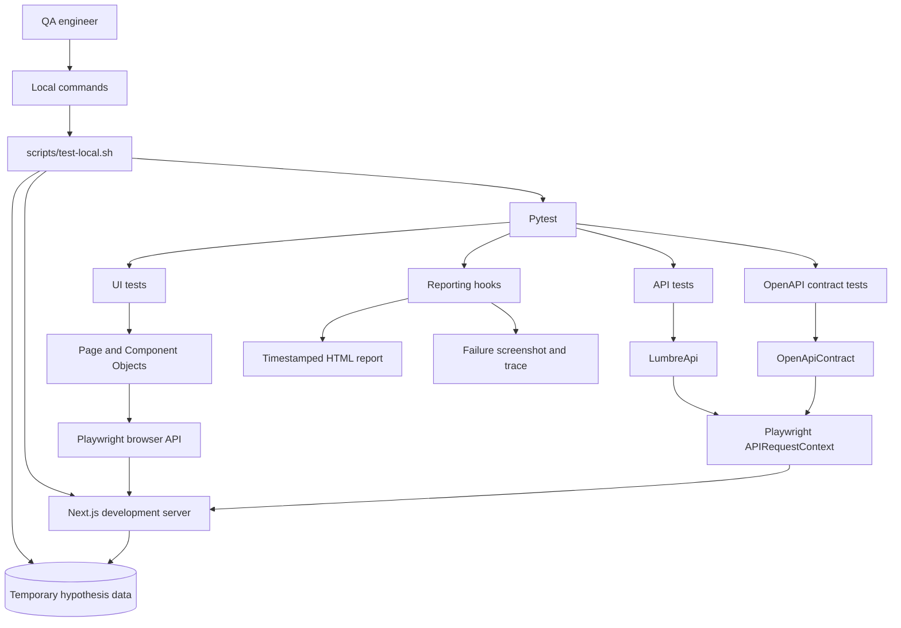
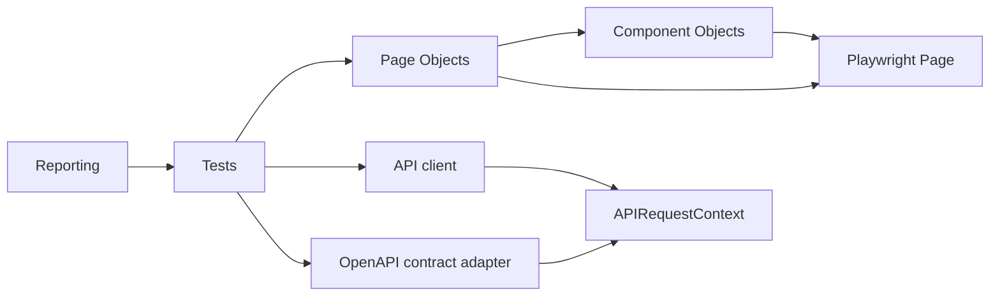
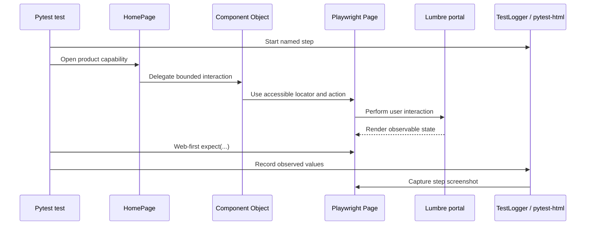
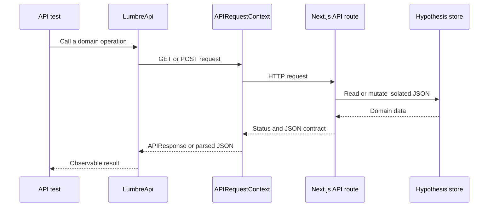
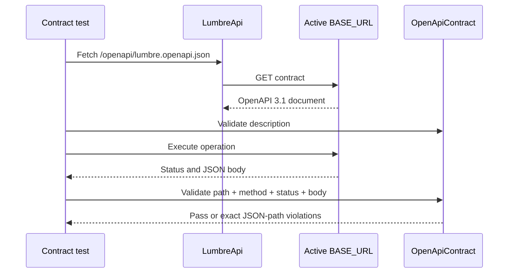
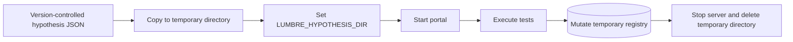

# Lumbre Test Architecture

> Scope: portal, API, Playwright framework, local orchestration, and evidence
> generation.

## 1. Architectural goals

The system is designed to demonstrate a maintainable automation boundary, not
only a collection of executable scripts. Its goals are:

1. keep tests focused on observable behavior;
2. centralize browser selectors and reusable actions;
3. test API contracts without requiring a browser;
4. preserve diagnostic evidence without adding logging code to every test;
5. isolate mutable hypothesis data from version-controlled seed files;
6. keep local execution reproducible across supported Playwright engines;
7. separate mutable test behavior from a safe, read-only production boundary.

## 2. System context



The same Playwright installation drives both browser automation and direct API
requests. Pytest supplies execution, fixtures, parametrization, markers, and
the reporting lifecycle.

## 3. Framework layers

| Layer | Location | Responsibility |
| --- | --- | --- |
| Test cases | `test-framework/tests/` | Arrange data, execute behavior, assert outcomes |
| Page Objects | `framework/pages/` | Own page-level navigation, composition, and entry points |
| Component Objects | `framework/components/` | Own locators and actions inside bounded UI widgets |
| API client | `framework/api/lumbre_api.py` | Express domain API operations through `APIRequestContext` |
| Contract adapter | `framework/contracts/openapi.py` | Validate remote OpenAPI descriptions and live JSON payloads |
| Configuration | `framework/config.py` and fixtures | Resolve base URL, browser, locale, and execution settings |
| Reporting | `framework/reporting/` | Attach metadata, logs, screenshots, URLs, and traces |
| Local orchestration | `scripts/` | Start services, isolate data, invoke Pytest, archive reports |

Tests are organized first by execution layer and then by functional ownership:

```text
tests/
├── api/
│   ├── system, recipes, products, membership, ingredients, hypotheses
│   └── contracts
└── ui/
    ├── home, recipes, membership, commerce, events, fire_planner
    └── ingredient_lab
```

Execution categories such as smoke, regression, and cross-browser remain
Pytest markers rather than directories because they cut across domains.

### Dependency direction



Tests may consume Page Objects, Component Objects exposed by a Page Object, the
API client, and reporting utilities. Page and Component Objects never import
test modules. Portal code does not depend on the automation framework.

## 4. Page and Component Object ownership

`HomePage` is the composition root for the portal. It owns page-level elements
and exposes bounded components:

```text
HomePage
├── Header
├── MembershipModal
├── CartDrawer
├── EventsSection
├── EventReservationModal
├── FirePlannerModal
└── IngredientLab
```

The ownership rule is based on DOM responsibility:

- a trigger in the home page belongs to `HomePage` or its containing component;
- controls inside a modal belong to that modal object;
- a test may assert observable behavior but should not recreate component
  selectors;
- a reusable workflow belongs in an object only when it represents product
  behavior, not a test-specific assertion.

This avoids both extremes: selectors scattered through tests and oversized
Page Objects that model the entire application as one class.

## 5. UI execution flow



Playwright locators remain lazy queries. Assertions retry until their condition
passes or the configured timeout expires. The framework therefore avoids
`time.sleep()` and fixed explicit waits.

## 6. API execution flow



Read-only convenience methods return parsed JSON when the response body is the
primary result. Mutation and negative-test methods preserve `APIResponse` when
status, headers, or raw body are part of the contract.

### Executable contract boundary

The contract adapter downloads the OpenAPI description through the active
`BASE_URL`; it never reads the portal repository directly. This keeps the
automation framework portable across local, CI, and remote targets.



OpenAPI describes operation ownership and status-specific payloads. JSON Schema
Draft 2020-12 performs the instance validation. Focused API tests still own the
business oracle; schema checks complement rather than replace them.

## 7. Mutable-data isolation

Hypothesis creation and duplicate counters intentionally persist to JSON so the
suite can validate state changes. The source registry must remain deterministic.

The local runner performs this lifecycle:



This makes mutation tests repeatable and prevents an interrupted learning run
from silently changing the repository baseline.

## 8. Environment boundary

The portal resolves one of three explicit environments. The local runner owns
the test selection instead of relying on the framework's generic Node mode.

| Environment | Mutation policy | Test-only routes | Registry implementation |
| --- | --- | --- | --- |
| `development` | Enabled for local exploration | Hidden | Local JSON files |
| `test` | Enabled for contract and persistence tests | Enabled | Temporary JSON files |
| `production` | Rejected at both route and store boundaries | Hidden as `404` | Bundled immutable seeds |

Production uses defense in depth: the UI does not collect membership data or
offer hypothesis creation, API discovery lists only reads, mutation handlers
return `405`, and the hypothesis store refuses write operations. The public
registry does not depend on a writable filesystem.

`LUMBRE_ENV` selects server behavior. `NEXT_PUBLIC_LUMBRE_ENV` selects the
matching browser experience and is fixed when the client bundle is built. Both
must represent the same environment.

## 9. Reporting architecture

`TestLogger` owns case identity, named steps, observed values, and screenshot
evidence. Pytest hooks enrich the HTML row with:

- case ID and behavior;
- captured step logs;
- screenshot per completed UI step;
- final browser URL;
- full-page failure screenshot;
- Playwright trace link when a trace exists.

The runner creates a self-contained timestamped report in `reports/runs/` and
copies the newest result to `reports/lumbre-report.html`. Historical reports
remain local and are excluded from Git because screenshots make them large.

## 10. Cross-browser strategy

Chromium is the default engine for functional UI depth. `BROWSER-001` launches
Chromium, Firefox, and WebKit directly and validates the critical home contract
in each engine. This separates broad Chromium regression depth from a focused
compatibility signal.

## 11. Design decisions and trade-offs

### Synchronous Playwright API

The framework uses Playwright's synchronous Python API. It keeps examples close
to the procedural style familiar to many QA engineers and avoids adding async
coordination where the test workflows do not need concurrency.

### POM plus Component Objects

POM provides navigation and page composition. Component Objects prevent modal,
drawer, and section details from accumulating inside one large `HomePage`.

### Risk coverage instead of line coverage

The primary metric is coverage of the committed functional-risk catalog.
Source-code coverage is not used as a substitute for meaningful product
assertions. The distinction is explicit in the coverage documentation.

### Parametrization only for equivalent contracts

Equivalent `404`, collection, form-constraint, and cooking-style contracts are
parameterized. Workflows that merely share setup remain separate when they
validate different risks, preserving isolation and failure diagnosis.

### Local-first orchestration

The current architecture prioritizes deterministic local learning. A future
public deployment can use the read-only production build without persistent
storage. CI, authentication, and hosted mutation storage remain deliberately
outside the completed scope.

## 12. Extension rules

When adding a capability:

1. identify the risk and assign stable case metadata;
2. add locators to the object that owns the DOM region;
3. add an action only when it represents reusable product behavior;
4. keep assertions in the test unless they are reusable contract helpers;
5. use Playwright web-first assertions for UI state;
6. record important inputs and observed outputs;
7. isolate mutable data;
8. update the risk catalog and architecture documentation if a boundary changes.
