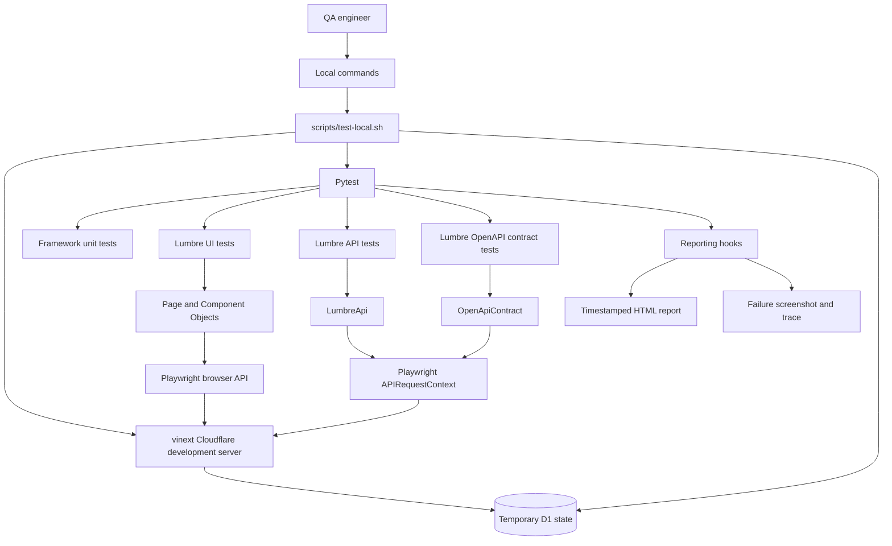
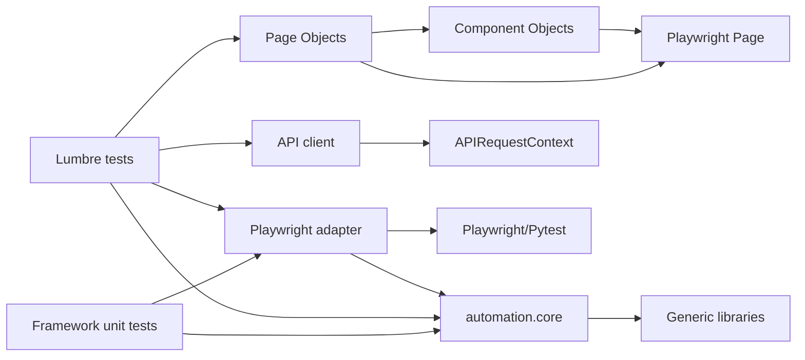
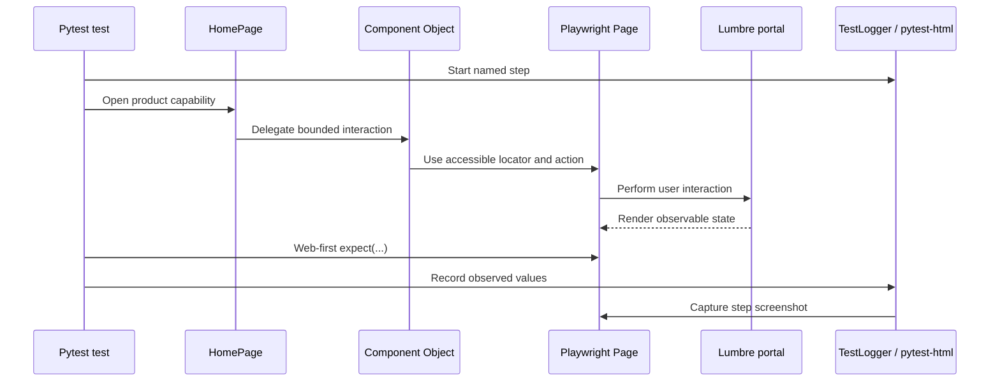
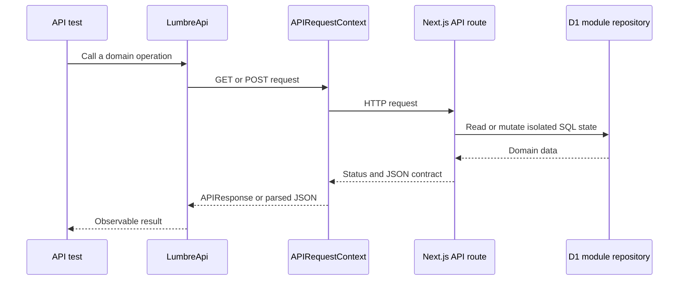
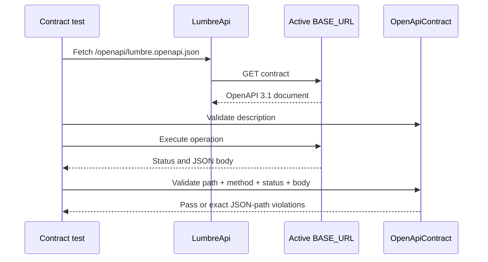
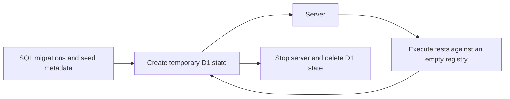
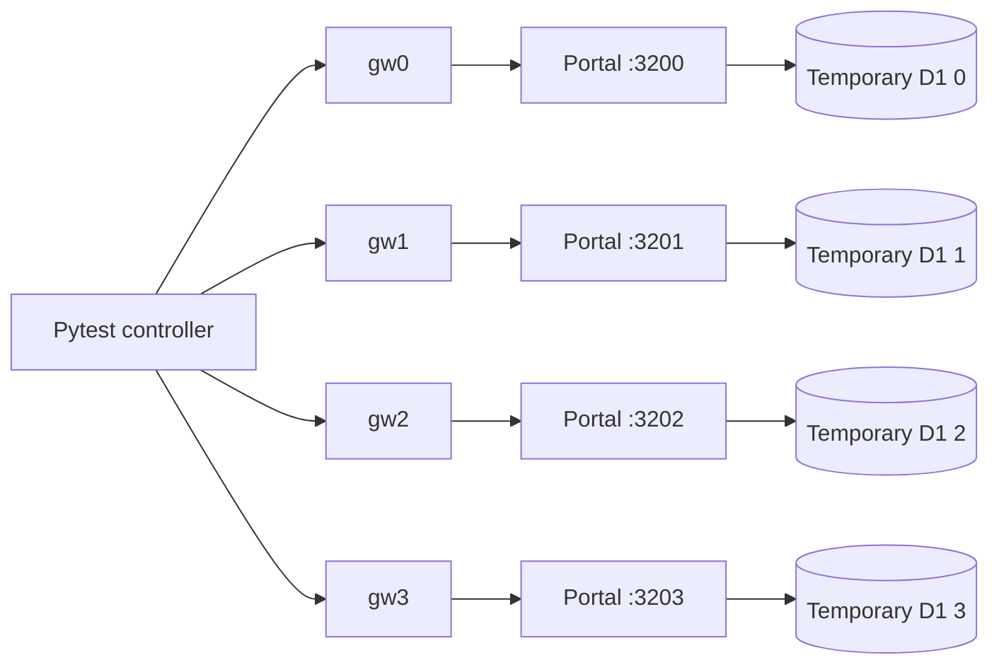

# Playwright Automation Architecture

> Scope: reusable automation core, project adapters, the Lumbre reference SUT,
> local orchestration, and evidence generation.

## 1. Architectural goals

The system is designed to demonstrate a maintainable automation boundary, not
only a collection of executable scripts. Its goals are:

1. keep tests focused on observable behavior;
2. centralize browser selectors and reusable actions;
3. test API contracts without requiring a browser;
4. preserve diagnostic evidence without adding logging code to every test;
5. isolate mutable test data in a per-run Cloudflare D1 database;
6. keep local execution reproducible across supported Playwright engines;
7. separate mutable test behavior from a protected production boundary.
8. prevent reusable infrastructure from depending on one product's selectors,
   routes, test data, or business language.

## 2. System context


```mermaid
flowchart TB
    Engineer[QA engineer] --> Commands[Local commands]
    Commands --> Runner[scripts/test-local.sh]

    Runner --> DevServer[vinext Cloudflare development server]
    Runner --> Pytest[Pytest]
    Runner --> TempD1[(Temporary D1 state)]

    Pytest --> Unit[Framework unit tests]
    Pytest --> UI[Lumbre UI tests]
    Pytest --> API[Lumbre API tests]
    Pytest --> Contracts[Lumbre OpenAPI contract tests]
    Pytest --> Evidence[Reporting hooks]

    UI --> POM[Page and Component Objects]
    POM --> Playwright[Playwright browser API]
    Playwright --> DevServer

    API --> Client[LumbreApi]
    Client --> RequestContext[Playwright APIRequestContext]
    RequestContext --> DevServer

    Contracts --> ContractAdapter[OpenApiContract]
    ContractAdapter --> RequestContext

    DevServer --> TempD1
    Evidence --> Report[Timestamped HTML report]
    Evidence --> Failure[Failure screenshot and trace]
```

The same Playwright installation drives both browser automation and direct API
requests. Pytest supplies execution, fixtures, parametrization, markers, and
the reporting lifecycle. Framework unit tests validate reusable behavior
without starting Lumbre or any other SUT.

## 3. Framework layers

| Layer | Location | Responsibility |
| --- | --- | --- |
| Framework unit tests | `test-framework/tests/framework/` | Validate configuration, diagnostics, and evidence independently of a SUT |
| Generic core | `test-framework/automation/core/` | Own configuration, contracts, reporting, and diagnostics |
| Playwright adapter | `test-framework/automation/adapters/playwright/` | Supply generic browser, request-context, URL, and logging fixtures |
| Lumbre functional tests | `test-framework/projects/lumbre/tests/` | Arrange Lumbre data, execute behavior, and assert outcomes |
| Lumbre Page Objects | `test-framework/projects/lumbre/pages/` | Own product navigation, composition, and entry points |
| Lumbre Component Objects | `test-framework/projects/lumbre/components/` | Own locators and actions inside product widgets |
| Lumbre API client | `test-framework/projects/lumbre/api/lumbre_api.py` | Express product routes through `APIRequestContext` |
| Lumbre fixtures | `test-framework/projects/lumbre/conftest.py` | Own product lifecycle, reset, contract, and POM composition |
| Local orchestration | `scripts/` | Start services, isolate data, invoke Pytest, archive reports |

Tests are organized first by execution layer and then by functional ownership:

```text
test-framework/
├── automation/
│   ├── core/
│   └── adapters/playwright/
├── projects/lumbre/
│   ├── api, pages, components
│   └── tests/
│       ├── api/
│       └── ui/
└── tests/framework/
```

Execution categories such as smoke, regression, and cross-browser remain
Pytest markers rather than directories because they cut across domains.

### Dependency direction


```mermaid
flowchart LR
    FrameworkTests[Framework unit tests] --> Core[automation.core]
    FrameworkTests --> Adapter[Playwright adapter]
    LumbreTests[Lumbre tests] --> PageObjects[Page Objects]
    LumbreTests --> ApiClient[API client]
    LumbreTests --> Core
    LumbreTests --> Adapter
    PageObjects --> Components[Component Objects]
    PageObjects --> PlaywrightPage[Playwright Page]
    Components --> PlaywrightPage
    ApiClient --> APIRequestContext
    Adapter --> Core
    Adapter --> Playwright[Playwright/Pytest]
    Core --> Libraries[Generic libraries]
```

The dependency rule is one-way: projects may consume `automation`, while
`automation` must never import `projects`. Product names, routes, locators,
fixtures, test data, and business workflows remain inside their project.
Portal code does not depend on the automation framework.

### Project registration boundary

The root `conftest.py` loads only generic plugins. Each project's `conftest.py`
composes its API client, Page Objects, reset strategy, and optional contracts.
`pyproject.toml` registers project test roots for discovery. This means a new
project can reuse execution and evidence without modifying the core.

The complete procedure and copy-ready examples are in
[Adding a project](ADDING_A_PROJECT.md).

## 4. Lumbre Page and Component Object ownership

`HomePage` is the composition root for the portal. It owns page-level elements
and exposes bounded components:

```text
HomePage
├── Header
├── AccountModal
├── MembershipModal
├── CartDrawer
├── EventsSection
├── EventReservationModal
├── FirePlanner
├── IngredientLab
└── ToastNotification
```

The ownership rule is based on DOM responsibility:

- a trigger in the home page belongs to `HomePage` or its containing component;
- controls inside a modal belong to that modal object;
- a test may assert observable behavior but should not recreate component
  selectors;
- a reusable workflow belongs in an object only when it represents product
  behavior, not a test-specific assertion.

This avoids both extremes: selectors scattered through tests and oversized
Page Objects that model the entire application as one class.

## 5. UI execution flow


```mermaid
sequenceDiagram
    participant Test as Pytest test
    participant Page as HomePage
    participant Component as Component Object
    participant Browser as Playwright Page
    participant Portal as Lumbre portal
    participant Report as TestLogger / pytest-html

    Test->>Report: Start named step
    Test->>Page: Open product capability
    Page->>Component: Delegate bounded interaction
    Component->>Browser: Use accessible locator and action
    Browser->>Portal: Perform user interaction
    Portal-->>Browser: Render observable state
    Test->>Browser: Web-first expect(...)
    Test->>Report: Record observed values
    Report->>Browser: Capture step screenshot
```

Playwright locators remain lazy queries. Assertions retry until their condition
passes or the configured timeout expires. The framework therefore avoids
`time.sleep()` and fixed explicit waits.

## 6. Lumbre API execution flow


```mermaid
sequenceDiagram
    participant Test as API test
    participant Client as LumbreApi
    participant Context as APIRequestContext
    participant Route as Next.js API route
    participant Store as D1 module repository

    Test->>Client: Call a domain operation
    Client->>Context: GET or POST request
    Context->>Route: HTTP request
    Route->>Store: Read or mutate isolated SQL state
    Store-->>Route: Domain data
    Route-->>Context: Status and JSON contract
    Context-->>Client: APIResponse or parsed JSON
    Client-->>Test: Observable result
```

Read-only convenience methods return parsed JSON when the response body is the
primary result. Mutation and negative-test methods preserve `APIResponse` when
status, headers, or raw body are part of the contract.

### Executable contract boundary

The contract adapter downloads the OpenAPI description through the active
`BASE_URL`; it never reads the portal repository directly. This keeps the
automation framework portable across local, CI, and remote targets.


```mermaid
sequenceDiagram
    participant Test as Contract test
    participant API as LumbreApi
    participant SUT as Active BASE_URL
    participant Contract as OpenApiContract

    Test->>API: Fetch /openapi/lumbre.openapi.json
    API->>SUT: GET contract
    SUT-->>API: OpenAPI 3.1 document
    Test->>Contract: Validate description
    Test->>SUT: Execute operation
    SUT-->>Test: Status and JSON body
    Test->>Contract: Validate path + method + status + body
    Contract-->>Test: Pass or exact JSON-path violations
```

OpenAPI describes operation ownership and status-specific payloads. JSON Schema
Draft 2020-12 performs the instance validation. Focused API tests still own the
business oracle; schema checks complement rather than replace them.

## 7. Mutable-data isolation

Hypothesis creation and duplicate counters persist to D1 so the suite exercises
the same storage boundary required by the Workers runtime. The registry starts
empty, making every stored combination attributable to a user action.

The local runner performs this lifecycle:


```mermaid
flowchart LR
    Seed[SQL migrations and seed metadata] --> Temp[Create temporary D1 state]
    Temp --> Server
    Server --> Tests[Execute tests against an empty registry]
    Tests --> Temp
    Temp --> Cleanup[Stop server and delete D1 state]
```

This makes mutation tests repeatable and prevents an interrupted learning run
from silently changing the repository baseline.

Authentication and checkout tests use the same reset boundary. Core account,
verification, session, local-delivery, cart, order, order-item, payment
attempt, hosted-checkout-session, provider-event, reservation, fire-preset,
membership-preference, consent-event, catalog, and administrative-audit tables
are cleared before each scenario; test mode then recreates one deterministic
administrator identity.

Event-reservation scenarios share the same isolation boundary. Reservations
are removed before account records because their ownership foreign key points
to the authenticated user.

Fire-planner presets follow a dual persistence boundary. Anonymous presets stay
in browser `localStorage`; authenticated presets belong to a user in D1. On
sign-in, the UI sends its local library to a sync use case that imports only
missing normalized names. Existing server names win, and authenticated writes
never mutate the anonymous library. API tests protect ownership and merge
rules, while `UI-042` uses two browser contexts with the same Playwright
`storage_state` to prove account-level restoration.

Membership enrollment and authenticated preferences are separate use cases.
The membership form can request club enrollment, but account creation never
implies newsletter consent. A user-owned D1 preference row stores the current
choice, while an append-only consent table records the initial choice and each
change. The API read model includes configuration metadata; the UI explicitly
projects it to a smaller write model before `PUT`, preserving the strict
request contract.

### Hosted payment boundary

The commerce service depends on a `HostedCheckoutPort`, not on Stripe-specific
route code. Test mode uses a deterministic adapter with the same session
contract; an explicitly configured environment uses Stripe's hosted Checkout
API. Lumbre sends the immutable order snapshot and receives only a provider
session identifier and redirect URL. Card collection remains on the provider.

Webhook processing begins with the raw request body. The adapter verifies the
timestamped HMAC signature before parsing the event, checks the provider
session, order identifier, currency, and amount against D1, and persists the
provider event ID as the deduplication key. Only the payload hash is retained;
the raw provider payload is not stored.

### Inventory lifecycle boundary

D1 is the inventory source of truth. Product projections expose stock for
availability feedback, but only server services mutate it. Cart writes and
order creation do not reserve units: a customer may prepare a cart without
locking merchandise indefinitely.

An approved local payment claims and consumes stock in one D1 batch. Hosted
checkout instead reserves stock before returning the provider redirect because
payment occurs outside Lumbre. A verified success changes `reserved` to `sold`
without a second decrement; a verified failure or expiration changes it to
`released` and restores the units.

Each order records `uncommitted`, `reserved`, `sold`, or `released` plus a
unique inventory claim key. Conditional order updates gate the transition, and
the same D1 batch applies the corresponding stock mutation. This makes payment
and webhook replay safe and prevents two competing order snapshots from
driving stock below zero. Administrative stock edits use the existing catalog
revision contract, so stale operators cannot silently replace a newer value.

### Order cancellation and fulfillment boundary

Payment status and fulfillment status are independent. A paid order begins as
`unfulfilled`, then an administrator may advance it to `processing` and finally
`fulfilled`; skips, reversals, and customer mutations are rejected. Every
accepted transition records its actor plus before and after state in the
administrative audit stream.

An owning account may cancel only a pending or failed order. If hosted checkout
has reserved inventory, Lumbre first expires the provider session and then
releases the stock in the same idempotent inventory boundary. Replaying the
cancellation returns the existing cancelled order without restoring units
again. A foreign account receives `404`, preserving the ownership-concealment
contract.

Paid cancellation is deliberately rejected because returning sold stock
without refunding money would create an invalid business state. Refunds are a
future provider-backed use case rather than an alias for cancellation.

### Administrative catalog and event capacity boundary

TypeScript product and event data remains reviewed seed input, while D1 owns
the runtime catalog. Public projections include active entries and omit
revision and audit metadata. Administrative routes authorize the persisted
role before parsing or applying a mutation; public catalog routes do not expose
write handlers.

Identifiers never change after creation. Updates include `expectedRevision`
in the strict request model and condition the SQL update on the matching
persisted revision. A concurrent stale editor receives `409`. Successful
creates and updates append an administrative event with the actor and before
and after representations.

D1 also owns each user reservation and its immutable event-name, location,
date, and party-size snapshot. The public event response derives remaining
places from confirmed reservations instead of trusting client state. An
administrative capacity update is rejected when its requested capacity is
below the confirmed party-size sum.

The administrator browser workspace is a Component Object boundary over these
APIs. It is rendered only for an authenticated `admin`, edits one copied record
at a time, and sends the record's current revision with every save. A `409`
keeps the unsaved fields intact and offers an explicit catalog reload instead
of silently replacing the user's work. Successful changes refetch the public
product and event projections so the store and agenda update without a full
page reload. Stock is editable in the same revision-protected product form;
zero stock projects a disabled **Agotado** action in the store. Product creation
remains API-only until image ownership and upload rules are defined.

Reservation creation uses one conditional `INSERT ... SELECT` statement. The
same statement checks both account uniqueness and aggregate confirmed capacity,
so the decision and insertion happen under one SQLite write operation. A
database unique index on `(event_id, user_id)` provides a second duplicate
boundary. Browser code submits only the event ID and party size.

### Authenticated fixture flow

The project fixtures request and consume deterministic local magic links
through `APIRequestContext`, export the resulting Playwright `storage_state`,
and install their cookies in each test's fresh browser context before navigation.
Separate customer and administrator states make role-specific browser
preconditions explicit without repeating authentication mechanics in every
test.
Tests that validate sign-in still perform the full UI flow; tests whose
precondition is merely “authenticated customer” reuse the fixture. No token or
magic-link URL is written to logs or reports.

## 8. Environment boundary

The portal resolves one of three explicit environments. The local runner owns
the test selection instead of relying on the framework's generic Node mode.

| Environment | Mutation policy | Test-only routes | Registry implementation |
| --- | --- | --- | --- |
| `development` | Enabled for local exploration | Hidden | Local D1 with user-created hypotheses |
| `test` | Enabled for contract and persistence tests | Enabled | Per-run temporary D1 |
| `production` | Anonymous cart writes plus one allowlisted account; commerce and public-data mutations disabled | Hidden as `404` | Remote D1 catalog, sessions, account-owned data, cart, and read-only public registry |

Production uses defense in depth: the UI does not collect membership data or
offer hypothesis creation, protected mutations require authenticated roles,
and the hypothesis route refuses write operations. Anonymous cart routes are the
explicit exception: they resolve an opaque cookie and constrain every D1 query
to its session. The public registry does not depend on a writable filesystem.

Development and test use Better Auth with its Drizzle/D1 adapter and a
passwordless magic-link plugin. The local delivery adapter writes only to an
isolated D1 outbox so automation can retrieve a deterministic link. Production
uses Resend's HTTPS API and suppresses every recipient except one secret
allowlisted operator while the provider test sender is in use. Account identity
and the separate marketing-membership form do not share consent state.

`LUMBRE_ENV` selects server behavior. `NEXT_PUBLIC_LUMBRE_ENV` selects the
matching browser experience and is fixed when the client bundle is built. Both
must represent the same environment.

### Worker-isolated parallel execution

pytest-xdist provides process concurrency, not test-data isolation. Lumbre's
autouse reset changes shared server state, so multiple workers cannot safely
target one portal instance. The parallel runner therefore creates one complete
local target per worker:


```mermaid
flowchart LR
    Controller[Pytest controller] --> GW0[gw0]
    Controller --> GW1[gw1]
    Controller --> GW2[gw2]
    Controller --> GW3[gw3]
    GW0 --> S0[Portal :3200] --> D0[(Temporary D1 0)]
    GW1 --> S1[Portal :3201] --> D1[(Temporary D1 1)]
    GW2 --> S2[Portal :3202] --> D2[(Temporary D1 2)]
    GW3 --> S3[Portal :3203] --> D3[(Temporary D1 3)]
```

The generic settings layer maps each xdist worker to an entry in
`AUTOMATION_WORKER_BASE_URLS`. Lumbre adds the product-specific safety rule that
rejects multi-worker collection when fewer isolated targets are configured.
The core does not start portals or databases; lifecycle orchestration remains a
project-owned runner responsibility.

## 9. Reporting architecture

`TestLogger` owns case identity, named steps, observed values, and screenshot
evidence. Pytest hooks enrich the HTML row with:

- case ID and behavior;
- captured step logs;
- screenshot per completed UI step;
- final browser URL;
- full-page failure screenshot;
- Playwright trace link when a trace exists.

The runner creates a self-contained timestamped report in `reports/runs/` and
copies the newest result to `reports/lumbre-report.html`. Historical reports
remain local and are excluded from Git because screenshots make them large.

## 10. Cross-browser strategy

Chromium is the default engine for functional UI depth. `BROWSER-001` launches
Chromium, Firefox, and WebKit directly and validates the critical home contract
in each engine. This separates broad Chromium regression depth from a focused
compatibility signal.

## 11. Design decisions and trade-offs

### Synchronous Playwright API

The framework uses Playwright's synchronous Python API. It keeps examples close
to the procedural style familiar to many QA engineers and avoids adding async
coordination where the test workflows do not need concurrency.

### POM plus Component Objects

POM provides navigation and page composition. Component Objects prevent modal,
drawer, and section details from accumulating inside one large `HomePage`.

### Risk coverage instead of line coverage

The primary metric is coverage of the committed functional-risk catalog.
Source-code coverage is not used as a substitute for meaningful product
assertions. The distinction is explicit in the coverage documentation.

### Parametrization only for equivalent contracts

Equivalent `404`, collection, form-constraint, and cooking-style contracts are
parameterized. Workflows that merely share setup remain separate when they
validate different risks, preserving isolation and failure diagnosis.

### Local-first, production-shaped orchestration

The current architecture prioritizes deterministic local learning while using
the same Worker and D1 boundaries intended for deployment. The public
production mode supports anonymous session carts while business data stays
read-only. Local and test modes add authenticated accounts and role
authorization without pretending that production email delivery is already
configured. CI and hosted business mutations remain outside the completed
scope.

## 12. Extension rules

When adding a product capability:

1. identify the risk and assign stable case metadata;
2. add locators to the object that owns the DOM region;
3. add an action only when it represents reusable product behavior;
4. keep assertions in the test unless they are reusable contract helpers;
5. use Playwright web-first assertions for UI state;
6. record important inputs and observed outputs;
7. isolate mutable data;
8. update the risk catalog and architecture documentation if a boundary changes.

When adding a reusable capability, implement it under `automation`, prove it
with a SUT-independent test under `tests/framework`, and keep project-specific
configuration behind fixtures or explicit settings. When onboarding another
SUT, follow [Adding a project](ADDING_A_PROJECT.md); do not duplicate the core.
