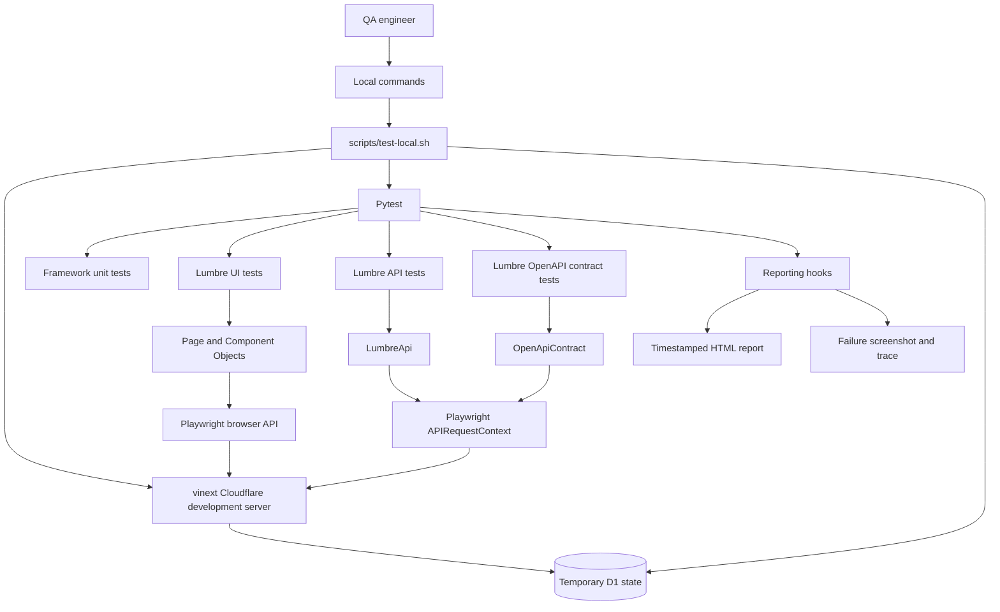
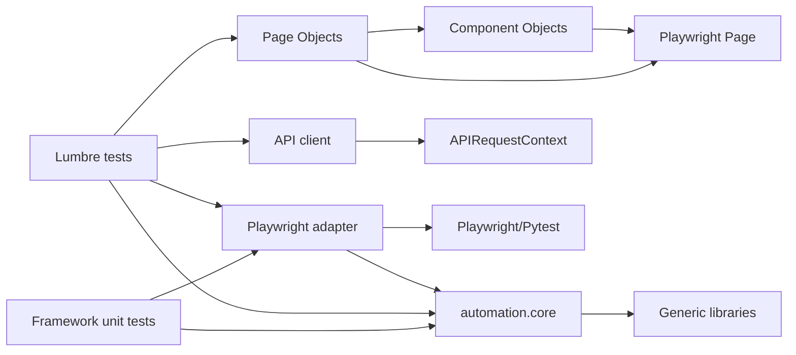
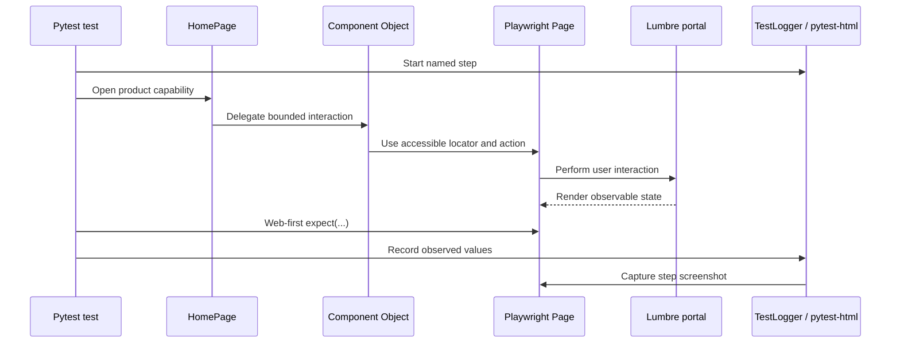
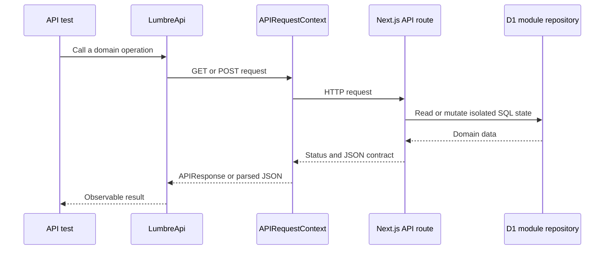
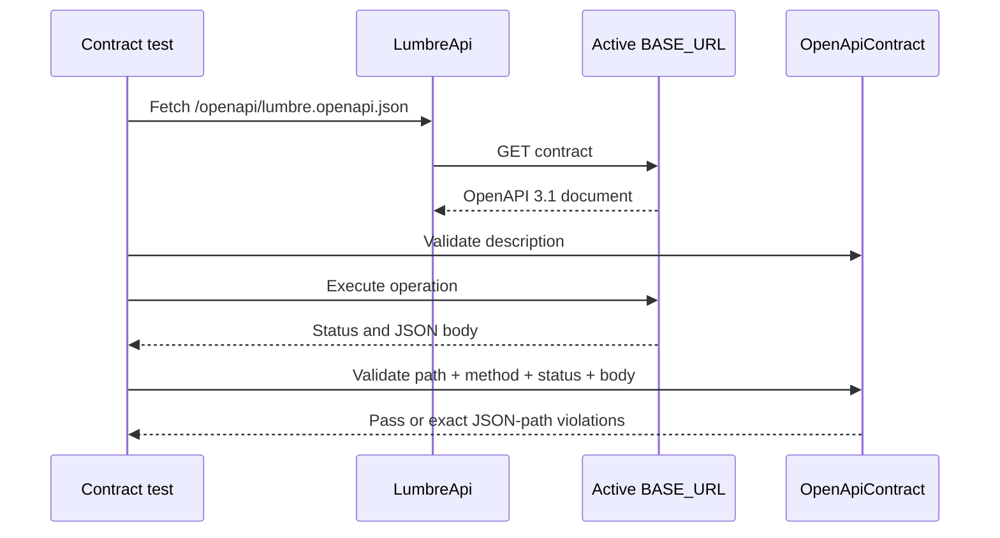
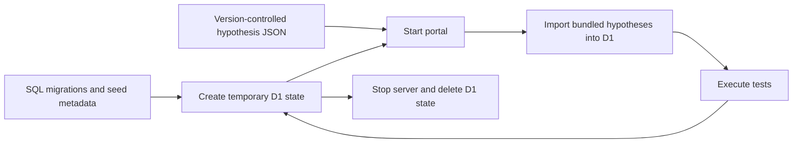

# Playwright Automation Architecture

> Scope: reusable automation core, project adapters, the Lumbre reference SUT,
> local orchestration, and evidence generation.

## 1. Architectural goals

The system is designed to demonstrate a maintainable automation boundary, not
only a collection of executable scripts. Its goals are:

1. keep tests focused on observable behavior;
2. centralize browser selectors and reusable actions;
3. test API contracts without requiring a browser;
4. preserve diagnostic evidence without adding logging code to every test;
5. isolate mutable test data in a per-run Cloudflare D1 database;
6. keep local execution reproducible across supported Playwright engines;
7. separate mutable test behavior from a protected production boundary.
8. prevent reusable infrastructure from depending on one product's selectors,
   routes, test data, or business language.

## 2. System context


```mermaid
flowchart TB
    Engineer[QA engineer] --> Commands[Local commands]
    Commands --> Runner[scripts/test-local.sh]

    Runner --> DevServer[vinext Cloudflare development server]
    Runner --> Pytest[Pytest]
    Runner --> TempD1[(Temporary D1 state)]

    Pytest --> Unit[Framework unit tests]
    Pytest --> UI[Lumbre UI tests]
    Pytest --> API[Lumbre API tests]
    Pytest --> Contracts[Lumbre OpenAPI contract tests]
    Pytest --> Evidence[Reporting hooks]

    UI --> POM[Page and Component Objects]
    POM --> Playwright[Playwright browser API]
    Playwright --> DevServer

    API --> Client[LumbreApi]
    Client --> RequestContext[Playwright APIRequestContext]
    RequestContext --> DevServer

    Contracts --> ContractAdapter[OpenApiContract]
    ContractAdapter --> RequestContext

    DevServer --> TempD1
    Evidence --> Report[Timestamped HTML report]
    Evidence --> Failure[Failure screenshot and trace]
```

The same Playwright installation drives both browser automation and direct API
requests. Pytest supplies execution, fixtures, parametrization, markers, and
the reporting lifecycle. Framework unit tests validate reusable behavior
without starting Lumbre or any other SUT.

## 3. Framework layers

| Layer | Location | Responsibility |
| --- | --- | --- |
| Framework unit tests | `test-framework/tests/framework/` | Validate configuration, diagnostics, and evidence independently of a SUT |
| Generic core | `test-framework/automation/core/` | Own configuration, contracts, reporting, and diagnostics |
| Playwright adapter | `test-framework/automation/adapters/playwright/` | Supply generic browser, request-context, URL, and logging fixtures |
| Lumbre functional tests | `test-framework/projects/lumbre/tests/` | Arrange Lumbre data, execute behavior, and assert outcomes |
| Lumbre Page Objects | `test-framework/projects/lumbre/pages/` | Own product navigation, composition, and entry points |
| Lumbre Component Objects | `test-framework/projects/lumbre/components/` | Own locators and actions inside product widgets |
| Lumbre API client | `test-framework/projects/lumbre/api/lumbre_api.py` | Express product routes through `APIRequestContext` |
| Lumbre fixtures | `test-framework/projects/lumbre/conftest.py` | Own product lifecycle, reset, contract, and POM composition |
| Local orchestration | `scripts/` | Start services, isolate data, invoke Pytest, archive reports |

Tests are organized first by execution layer and then by functional ownership:

```text
test-framework/
├── automation/
│   ├── core/
│   └── adapters/playwright/
├── projects/lumbre/
│   ├── api, pages, components
│   └── tests/
│       ├── api/
│       └── ui/
└── tests/framework/
```

Execution categories such as smoke, regression, and cross-browser remain
Pytest markers rather than directories because they cut across domains.

### Dependency direction


```mermaid
flowchart LR
    FrameworkTests[Framework unit tests] --> Core[automation.core]
    FrameworkTests --> Adapter[Playwright adapter]
    LumbreTests[Lumbre tests] --> PageObjects[Page Objects]
    LumbreTests --> ApiClient[API client]
    LumbreTests --> Core
    LumbreTests --> Adapter
    PageObjects --> Components[Component Objects]
    PageObjects --> PlaywrightPage[Playwright Page]
    Components --> PlaywrightPage
    ApiClient --> APIRequestContext
    Adapter --> Core
    Adapter --> Playwright[Playwright/Pytest]
    Core --> Libraries[Generic libraries]
```

The dependency rule is one-way: projects may consume `automation`, while
`automation` must never import `projects`. Product names, routes, locators,
fixtures, test data, and business workflows remain inside their project.
Portal code does not depend on the automation framework.

### Project registration boundary

The root `conftest.py` loads only generic plugins. Each project's `conftest.py`
composes its API client, Page Objects, reset strategy, and optional contracts.
`pyproject.toml` registers project test roots for discovery. This means a new
project can reuse execution and evidence without modifying the core.

The complete procedure and copy-ready examples are in
[Adding a project](ADDING_A_PROJECT.md).

## 4. Lumbre Page and Component Object ownership

`HomePage` is the composition root for the portal. It owns page-level elements
and exposes bounded components:

```text
HomePage
├── Header
├── AccountModal
├── MembershipModal
├── CartDrawer
├── EventsSection
├── EventReservationModal
├── FirePlanner
├── IngredientLab
└── ToastNotification
```

The ownership rule is based on DOM responsibility:

- a trigger in the home page belongs to `HomePage` or its containing component;
- controls inside a modal belong to that modal object;
- a test may assert observable behavior but should not recreate component
  selectors;
- a reusable workflow belongs in an object only when it represents product
  behavior, not a test-specific assertion.

This avoids both extremes: selectors scattered through tests and oversized
Page Objects that model the entire application as one class.

## 5. UI execution flow


```mermaid
sequenceDiagram
    participant Test as Pytest test
    participant Page as HomePage
    participant Component as Component Object
    participant Browser as Playwright Page
    participant Portal as Lumbre portal
    participant Report as TestLogger / pytest-html

    Test->>Report: Start named step
    Test->>Page: Open product capability
    Page->>Component: Delegate bounded interaction
    Component->>Browser: Use accessible locator and action
    Browser->>Portal: Perform user interaction
    Portal-->>Browser: Render observable state
    Test->>Browser: Web-first expect(...)
    Test->>Report: Record observed values
    Report->>Browser: Capture step screenshot
```

Playwright locators remain lazy queries. Assertions retry until their condition
passes or the configured timeout expires. The framework therefore avoids
`time.sleep()` and fixed explicit waits.

## 6. Lumbre API execution flow


```mermaid
sequenceDiagram
    participant Test as API test
    participant Client as LumbreApi
    participant Context as APIRequestContext
    participant Route as Next.js API route
    participant Store as D1 module repository

    Test->>Client: Call a domain operation
    Client->>Context: GET or POST request
    Context->>Route: HTTP request
    Route->>Store: Read or mutate isolated SQL state
    Store-->>Route: Domain data
    Route-->>Context: Status and JSON contract
    Context-->>Client: APIResponse or parsed JSON
    Client-->>Test: Observable result
```

Read-only convenience methods return parsed JSON when the response body is the
primary result. Mutation and negative-test methods preserve `APIResponse` when
status, headers, or raw body are part of the contract.

### Executable contract boundary

The contract adapter downloads the OpenAPI description through the active
`BASE_URL`; it never reads the portal repository directly. This keeps the
automation framework portable across local, CI, and remote targets.


```mermaid
sequenceDiagram
    participant Test as Contract test
    participant API as LumbreApi
    participant SUT as Active BASE_URL
    participant Contract as OpenApiContract

    Test->>API: Fetch /openapi/lumbre.openapi.json
    API->>SUT: GET contract
    SUT-->>API: OpenAPI 3.1 document
    Test->>Contract: Validate description
    Test->>SUT: Execute operation
    SUT-->>Test: Status and JSON body
    Test->>Contract: Validate path + method + status + body
    Contract-->>Test: Pass or exact JSON-path violations
```

OpenAPI describes operation ownership and status-specific payloads. JSON Schema
Draft 2020-12 performs the instance validation. Focused API tests still own the
business oracle; schema checks complement rather than replace them.

## 7. Mutable-data isolation

Hypothesis creation and duplicate counters persist to D1 so the suite exercises
the same storage boundary required by the Workers runtime. Version-controlled
JSON remains editorial seed input and is never a request-time write target.

The local runner performs this lifecycle:


```mermaid
flowchart LR
    Seed[SQL migrations and seed metadata] --> Temp[Create temporary D1 state]
    JSON[Version-controlled hypothesis JSON] --> Server[Start portal]
    Temp --> Server
    Server --> Import[Import bundled hypotheses into D1]
    Import --> Tests[Execute tests]
    Tests --> Temp
    Temp --> Cleanup[Stop server and delete D1 state]
```

This makes mutation tests repeatable and prevents an interrupted learning run
from silently changing the repository baseline.

Authentication and checkout tests use the same reset boundary. Core account,
verification, session, local-delivery, cart, order, order-item, payment
attempt, hosted-checkout-session, and provider-event tables are cleared before
each scenario; test mode then recreates one deterministic administrator
identity.

Event-reservation scenarios share the same isolation boundary. Reservations
are removed before account records because their ownership foreign key points
to the authenticated user.

### Hosted payment boundary

The commerce service depends on a `HostedCheckoutPort`, not on Stripe-specific
route code. Test mode uses a deterministic adapter with the same session
contract; an explicitly configured environment uses Stripe's hosted Checkout
API. Lumbre sends the immutable order snapshot and receives only a provider
session identifier and redirect URL. Card collection remains on the provider.

Webhook processing begins with the raw request body. The adapter verifies the
timestamped HMAC signature before parsing the event, checks the provider
session, order identifier, currency, and amount against D1, and persists the
provider event ID as the deduplication key. Only the payload hash is retained;
the raw provider payload is not stored.

### Event capacity boundary

The TypeScript event catalog remains reviewed editorial content. D1 owns each
user reservation and its immutable event-name, location, date, and party-size
snapshot. The public event response derives remaining places from confirmed
reservations instead of trusting client state.

Reservation creation uses one conditional `INSERT ... SELECT` statement. The
same statement checks both account uniqueness and aggregate confirmed capacity,
so the decision and insertion happen under one SQLite write operation. A
database unique index on `(event_id, user_id)` provides a second duplicate
boundary. Browser code submits only the event ID and party size.

### Authenticated fixture flow

The project fixture requests and consumes a deterministic local magic link
through `APIRequestContext`, exports the resulting Playwright `storage_state`,
and installs its cookies in the test's fresh browser context before navigation.
Tests that validate sign-in still perform the full UI flow; tests whose
precondition is merely “authenticated customer” reuse the fixture. No token or
magic-link URL is written to logs or reports.

## 8. Environment boundary

The portal resolves one of three explicit environments. The local runner owns
the test selection instead of relying on the framework's generic Node mode.

| Environment | Mutation policy | Test-only routes | Registry implementation |
| --- | --- | --- | --- |
| `development` | Enabled for local exploration | Hidden | Local D1 initialized from bundled seeds |
| `test` | Enabled for contract and persistence tests | Enabled | Per-run temporary D1 |
| `production` | Anonymous cart writes enabled; account access and protected business writes disabled | Hidden as `404` | Remote D1 cart plus bundled immutable hypotheses |

Production uses defense in depth: the UI does not collect membership data or
offer hypothesis creation, protected mutation handlers return `405`, and the
hypothesis store refuses write operations. Anonymous cart routes are the
explicit exception: they resolve an opaque cookie and constrain every D1 query
to its session. The public registry does not depend on a writable filesystem.

Development and test use Better Auth with its Drizzle/D1 adapter and a
passwordless magic-link plugin. The local delivery adapter writes only to an
isolated D1 outbox so automation can retrieve a deterministic link. Production
does not expose this adapter and refuses authentication until a real email
provider and production secrets are configured. Account identity and the
separate marketing-membership form do not share consent state.

`LUMBRE_ENV` selects server behavior. `NEXT_PUBLIC_LUMBRE_ENV` selects the
matching browser experience and is fixed when the client bundle is built. Both
must represent the same environment.

## 9. Reporting architecture

`TestLogger` owns case identity, named steps, observed values, and screenshot
evidence. Pytest hooks enrich the HTML row with:

- case ID and behavior;
- captured step logs;
- screenshot per completed UI step;
- final browser URL;
- full-page failure screenshot;
- Playwright trace link when a trace exists.

The runner creates a self-contained timestamped report in `reports/runs/` and
copies the newest result to `reports/lumbre-report.html`. Historical reports
remain local and are excluded from Git because screenshots make them large.

## 10. Cross-browser strategy

Chromium is the default engine for functional UI depth. `BROWSER-001` launches
Chromium, Firefox, and WebKit directly and validates the critical home contract
in each engine. This separates broad Chromium regression depth from a focused
compatibility signal.

## 11. Design decisions and trade-offs

### Synchronous Playwright API

The framework uses Playwright's synchronous Python API. It keeps examples close
to the procedural style familiar to many QA engineers and avoids adding async
coordination where the test workflows do not need concurrency.

### POM plus Component Objects

POM provides navigation and page composition. Component Objects prevent modal,
drawer, and section details from accumulating inside one large `HomePage`.

### Risk coverage instead of line coverage

The primary metric is coverage of the committed functional-risk catalog.
Source-code coverage is not used as a substitute for meaningful product
assertions. The distinction is explicit in the coverage documentation.

### Parametrization only for equivalent contracts

Equivalent `404`, collection, form-constraint, and cooking-style contracts are
parameterized. Workflows that merely share setup remain separate when they
validate different risks, preserving isolation and failure diagnosis.

### Local-first, production-shaped orchestration

The current architecture prioritizes deterministic local learning while using
the same Worker and D1 boundaries intended for deployment. The public
production mode supports anonymous session carts while business data stays
read-only. Local and test modes add authenticated accounts and role
authorization without pretending that production email delivery is already
configured. CI and hosted business mutations remain outside the completed
scope.

## 12. Extension rules

When adding a product capability:

1. identify the risk and assign stable case metadata;
2. add locators to the object that owns the DOM region;
3. add an action only when it represents reusable product behavior;
4. keep assertions in the test unless they are reusable contract helpers;
5. use Playwright web-first assertions for UI state;
6. record important inputs and observed outputs;
7. isolate mutable data;
8. update the risk catalog and architecture documentation if a boundary changes.

When adding a reusable capability, implement it under `automation`, prove it
with a SUT-independent test under `tests/framework`, and keep project-specific
configuration behind fixtures or explicit settings. When onboarding another
SUT, follow [Adding a project](ADDING_A_PROJECT.md); do not duplicate the core.
