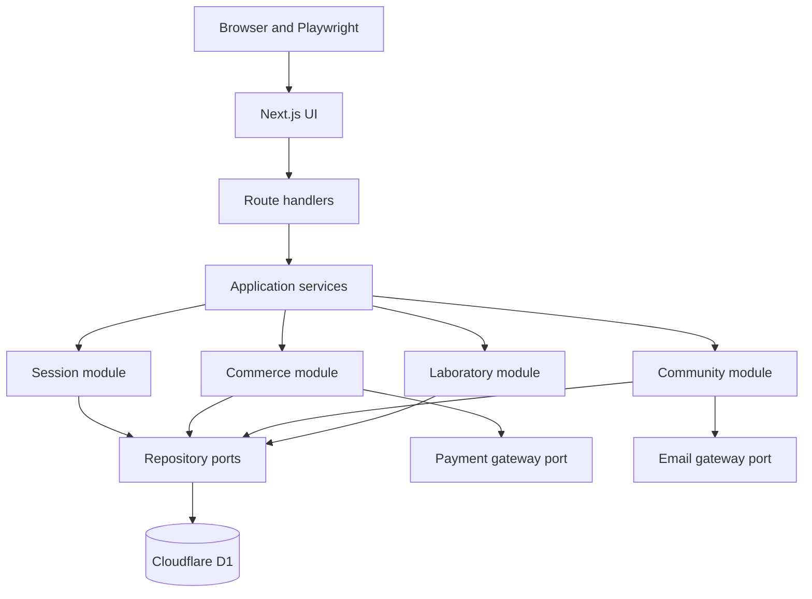

# Lumbre Production Architecture Migration Plan

> Status: Phase 4 orders and deterministic local payments completed and
> regression-validated locally on 2026-09-23.

## 1. Purpose

Lumbre currently provides a deterministic local system under test for the
Playwright Python framework. This plan evolves that reference application into
a production-capable transactional system without turning the portal into the
primary portfolio product or weakening the automation learning goals.

The migration is deliberately incremental. Every phase must deliver one
observable vertical slice, extend the automated risk catalog, preserve a
timestamped report, and pass the complete regression suite before the next
phase begins.

## 2. Phase 0 baseline

The current working tree was validated before introducing persistence or
session behavior.

| Check | Result |
| --- | --- |
| Portal ESLint | Passed |
| Portal production build | Passed |
| vinext compatibility | 94% compatible; 0 issues, 1 partial feature |
| Full Pytest execution | 84 passed in 63.33 seconds |
| Browser engines | Chromium, Firefox, WebKit passed |
| Archived report | `reports/runs/lumbre-report-2026-09-23_14-29-31.html` |
| Tracked credential files | None found |
| Secret-like values in project sources | None found by the Phase 0 scan |

Phase 1 subsequently passed portal lint, TypeScript checking, the vinext
production build, and all 85 Pytest executions. Its archived regression report
is `reports/runs/lumbre-report-2026-09-23_15-12-21.html`.

Phase 2 passed portal lint, TypeScript checking, the vinext production build,
and all 92 Pytest executions in 67.03 seconds. Its archived regression report
is `reports/runs/lumbre-report-2026-09-23_16-21-58.html`.

Phase 3 passed portal lint, TypeScript checking, the vinext production build,
all framework static checks, and all 102 Pytest executions in 79.07 seconds.
Its archived report is
`reports/runs/lumbre-report-2026-09-23_17-43-37.html`.

Phase 4 passed portal lint, TypeScript checking, the vinext production build,
all framework static checks, and all 108 Pytest executions in 72.91 seconds.
Its archived report is
`reports/runs/lumbre-report-2026-09-23_18-12-58.html`.

The partial vinext capability is `next/font/google`: fonts are loaded from a
CDN rather than self-hosted at build time. This does not block the migration,
but production readiness requires replacing it with a local font before public
deployment.

Cloudflare local secret files use the `.dev.vars` convention. They are now
ignored by Git, while an optional `.dev.vars.example` may be committed later
with names only and no secret values.

## 3. Current-state assessment

| Capability | Current source of truth | Production gap |
| --- | --- | --- |
| Cart | D1 records constrained by an opaque anonymous session or authenticated account | No inventory reservation |
| Checkout | Toast notification | No order or payment exists |
| Membership | Stateless route with a fixed demo identifier | No member record or authenticated identity |
| Event reservation | Modal and toast | No capacity or reservation is changed |
| Fire-planner presets | Browser `localStorage` | Cannot synchronize across devices or accounts |
| Hypotheses | D1 in development/test; bundled JSON seeds in production | Hosted writes require identity and authorization |
| Products | Static TypeScript catalog, with cart prices and totals derived server-side | No database-backed inventory or price revisions |
| Sessions | Anonymous session plus Better Auth account sessions backed by D1 | Production email delivery remains intentionally disabled |
| Database | Drizzle schema, SQL migrations, deterministic seed, and Worker `DB` binding | Remote provisioning and operational backups remain pending |

The production switch is a safe public-demo boundary: reads and anonymous cart
writes are enabled, while account access, membership, catalog, and laboratory
writes stay disabled. Local and test modes exercise authenticated ownership and
role authorization. Each additional hosted mutation must still be backed by
persistence, validation, and an explicit access policy.

## 4. Architectural decision

Lumbre will remain a modular monolith:



Route handlers translate HTTP requests and responses. Application services own
use cases and transaction boundaries. Repositories own persistence. External
providers are accessed through ports so local and test adapters can replace
real services deterministically.

Microservices are explicitly out of scope. The present scale and team size do
not justify distributed deployment, network boundaries, or duplicated
observability infrastructure.

## 5. Technology decisions

- Keep Next.js 16 and the current vinext/Cloudflare Workers target.
- Use Cloudflare D1 as the relational transactional store.
- Use Drizzle ORM for a typed schema and SQL access.
- Store migrations as version-controlled SQL and apply them with Wrangler.
- Use Zod schemas at HTTP and provider boundaries.
- Keep the public OpenAPI 3.1 contract and update it in the same change as each
  API slice.
- Use Better Auth with its Drizzle/D1 adapter and magic-link plugin. Lumbre does
  not implement passwords, verification tokens, or authenticated cookies.
- Introduce a local fake payment adapter before choosing or integrating an
  external provider.
- Keep static images in the repository initially. R2 is not required for the
  first transactional release.

## 6. Data ownership

### Version-controlled editorial data

- recipes and their editorial metadata;
- researched ingredient catalog;
- researched formula definitions;
- image assets;
- the fire-planner calculation model.

### D1 transactional data

- anonymous and authenticated sessions;
- user identities and membership preferences;
- products, price revisions, and inventory;
- carts and cart items;
- orders and immutable order-item snapshots;
- payment attempts and received provider events;
- events, capacity, and reservations;
- user-owned planner presets;
- created hypotheses, formula components, and duplicate counters.

Client storage may cache presentation preferences, but it must not become the
authority for money, inventory, identity, reservations, or order state.

## 7. Target module boundaries

The exact implementation paths will be introduced in Phase 1, following this
ownership model:

```text
portal/
├── app/api/                    HTTP adapters only
├── server/
│   ├── platform/
│   │   ├── database/
│   │   ├── validation/
│   │   └── observability/
│   └── modules/
│       ├── sessions/
│       ├── commerce/
│       ├── community/
│       ├── reservations/
│       └── laboratory/
└── drizzle/                    Version-controlled SQL migrations
```

Each module may contain domain types, application services, repository ports,
and infrastructure adapters. Modules must not import React components or
Playwright framework code.

## 8. Delivery phases

### Phase 1: D1 foundation — completed

Deliver:

- real local `DB` binding;
- Drizzle schema and first migration;
- deterministic seed command;
- database factory and repository boundaries;
- database readiness included in health diagnostics;
- isolated test database lifecycle;
- documented local migration commands.

No customer-facing workflow changed in this phase. Hypothesis persistence was
moved into D1 as an infrastructure prerequisite because Cloudflare Workers do
not provide a writable request-time filesystem; its API contract remained the
same.

Exit criteria:

- an empty local environment can be migrated and seeded from commands in the
  repository;
- development and test databases are separate;
- the health contract reports database readiness;
- focused database checks, OpenAPI tests, and the full suite pass.

### Phase 2: anonymous session and persistent cart — completed

Deliver:

- opaque random server session identifier;
- `HttpOnly`, `SameSite=Lax`, and production `Secure` cookie policy;
- carts and cart items in D1;
- quantity-aware cart API;
- server-authoritative product prices and totals;
- cart restoration after reload.

Automation risks:

- cookie attributes are correct;
- separate browser contexts cannot see each other's carts;
- a cart survives reload;
- add, update, and remove operations persist;
- manipulated client prices are ignored;
- repeated or concurrent requests do not corrupt quantities.

Completion evidence:

- migration `0002_jittery_mystique.sql` creates sessions, carts, and line items;
- OpenAPI publishes all four cart operations and validates their live payloads;
- `API-022` through `API-024` protect cookie policy, server pricing, repeated
  adds, quantity replacement, removal, and persistence;
- `UI-035` proves reload restoration and `UI-036` proves browser-context
  isolation;
- focused validation passed `26/26` and the full regression passed `92/92`.

### Phase 3: authenticated account — completed locally

Deliver:

- account registration and sign-in;
- email verification or magic-link flow;
- logout and session expiry;
- anonymous-cart merge on sign-in;
- `customer` and `admin` authorization;
- separation of account identity from marketing membership consent.

Automation risks:

- authenticated fixtures use Playwright `storage_state`;
- unauthenticated access is rejected consistently;
- logout and expiry invalidate access;
- user data remains isolated;
- cart merging is deterministic and does not duplicate items.

Completion evidence:

- migration `0003_chemical_cable.sql` creates Better Auth core tables, a
  non-production delivery outbox, and account-owned carts;
- Better Auth 1.7 uses the Drizzle/D1 adapter and a passwordless, single-use
  magic-link flow with a 30-day session lifetime;
- production refuses account access and never exposes the deterministic local
  delivery route;
- `API-025` through `API-030` protect one-time verification, logout, expiry,
  anonymous cart promotion, `401/403` authorization, administrator access, and
  collision-safe cart merge;
- `UI-037` protects the visible account journey and `UI-038` proves reusable
  authenticated setup with Playwright `storage_state`;
- OpenAPI publishes the account facade and role-protected admin resource;
- focused authentication and contract validation passed `30/30`.
- the complete regression passed `102/102` across Chromium, Firefox, and
  WebKit where configured.

### Phase 4: order and fake payment vertical slice — completed locally

Deliver:

- checkout page and validated customer details;
- order and immutable order-item records;
- server-side total calculation;
- statuses `pending`, `paid`, `failed`, and `cancelled`;
- deterministic local payment adapter supporting success and rejection;
- idempotency keys for order creation and payment initiation.

Automation risks:

- successful and rejected payment paths;
- double submission creates only one order;
- client-side total manipulation cannot change the order;
- the cart is cleared only after the defined successful state;
- order history reflects the persisted result.

Completion evidence:

- migration `0004_conscious_rocket_raccoon.sql` creates account-owned orders,
  immutable order-item snapshots, and payment-attempt records;
- the server rejects client totals and derives every snapshot from its catalog;
- independent order and payment idempotency keys return the original result;
- the local payment port deterministically approves or rejects without an
  external provider, clearing the cart only after approval;
- `API-031` through `API-035` protect authorization, pricing integrity,
  idempotency, both payment transitions, cart behavior, persistence, and live
  OpenAPI response contracts;
- `UI-025` protects anonymous account guidance and `UI-039` proves the complete
  authenticated checkout and persisted order-history journey;
- OpenAPI publishes 24 route operations, including order history, creation,
  detail, and payment initiation.

### Phase 5: external payment sandbox

Deliver:

- one external hosted-checkout adapter;
- signed webhook verification;
- provider-event deduplication;
- retry-safe payment transitions;
- no card data stored or transported by Lumbre.

The default recommendation is to evaluate Stripe Checkout first because of its
test environment and idempotency support. Mercado Pago remains a valid second
adapter when Mexican payment-method relevance becomes the higher priority.

### Phase 6: remaining transactional features

Migrate one capability per vertical slice:

1. reservation capacity and customer reservations;
2. synchronized fire-planner presets;
3. membership preferences;
4. administrative products and events.

Existing hypothesis JSON remains the reviewed editorial seed source. D1 is the
validated development/test write target and the Worker never writes JSON.

### Phase 7: production hardening

- rate limits for abuse-sensitive operations;
- CSRF protection where the selected session mechanism requires it;
- structured logs and request correlation IDs;
- sanitized error responses;
- administrative audit events;
- D1 backup/export procedure;
- secret rotation procedure;
- privacy and retention policy;
- post-deployment smoke suite.

## 9. Increment protocol

Every production increment follows the same evidence loop:

1. define one product risk and its acceptance contract;
2. update OpenAPI before or with the implementation;
3. add a focused API test;
4. implement the smallest application and persistence slice;
5. add a UI test only when browser behavior adds a distinct risk;
6. run portal lint and production build;
7. run focused tests;
8. run the complete suite;
9. archive the timestamped HTML report;
10. commit the independently reversible slice.

The Python Playwright framework remains the main acceptance-test system. Small
portal-side unit tests may be added for pure domain calculations, but they do
not replace API contracts or browser workflows.

## 10. Environment and secret policy

| Environment | Persistence | External providers | Reset behavior |
| --- | --- | --- | --- |
| `development` | Local D1 simulation | Local adapters by default | Manual seed/reset command |
| `test` | Per-run isolated local D1 | Deterministic fake adapters | Automatic before a run |
| `production` | Remote D1 binding | Explicit production adapters | No reset endpoint |

- `.env` and `.dev.vars` files are local and ignored.
- Example files contain variable names and safe placeholders only.
- Production secrets live in Cloudflare secret bindings.
- `NEXT_PUBLIC_*` values are never treated as secrets.
- Automated tests must never connect to remote D1 unless a separate explicit
  remote-test workflow is introduced.

## 11. Security invariants

- Product price and totals are always derived by the server.
- Session cookies never contain personal or cart data.
- Password hashes, provider secrets, tokens, and card data never appear in API
  responses, logs, reports, screenshots, or repository files.
- Administrative mutations require authorization, not only a hidden control.
- Webhook state transitions are verified and idempotent.
- Test-only reset behavior returns `404` outside the test environment.
- Every user-owned query is constrained by the resolved session or user ID.

## 12. Immediate next increment

Phase 5 begins by evaluating an external hosted-checkout sandbox behind the
existing payment port. Before adding a provider, define webhook signature
verification, provider-event deduplication, retry-safe transition rules, and a
test boundary that never transports or stores card data in Lumbre.

Production authentication remains disabled until an actual email provider and
secret bindings are selected. That deployment integration does not block local
Phase 4 modeling or automation learning.
