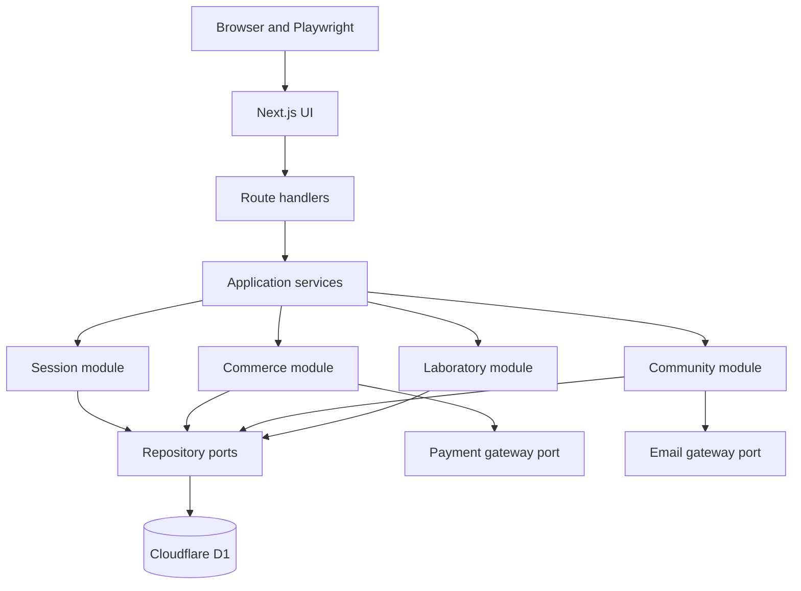

# Lumbre Production Architecture Migration Plan

> Status: release candidate. Phase 7A hardening is complete; staging, remote
> Playwright smoke, recovery rehearsal, privacy, and secret gates are live.
> The production public-demo preflight and guarded D1 export pass. The explicit
> production promotion is the only remaining technical release action before
> the first public URL is live.

## 1. Purpose

Lumbre currently provides a deterministic local system under test for the
Playwright Python framework. This plan evolves that reference application into
a production-capable transactional system without turning the portal into the
primary portfolio product or weakening the automation learning goals.

The migration is deliberately incremental. Every phase must deliver one
observable vertical slice, extend the automated risk catalog, preserve a
timestamped report, and pass the complete regression suite before the next
phase begins.

## 2. Phase 0 baseline

The current working tree was validated before introducing persistence or
session behavior.

| Check | Result |
| --- | --- |
| Portal ESLint | Passed |
| Portal production build | Passed |
| vinext compatibility | 94% compatible; 0 issues, 1 partial feature |
| Full Pytest execution | 84 passed in 63.33 seconds |
| Browser engines | Chromium, Firefox, WebKit passed |
| Archived report | `reports/runs/lumbre-report-2026-09-23_14-29-31.html` |
| Tracked credential files | None found |
| Secret-like values in project sources | None found by the Phase 0 scan |

Phase 1 subsequently passed portal lint, TypeScript checking, the vinext
production build, and all 85 Pytest executions. Its archived regression report
is `reports/runs/lumbre-report-2026-09-23_15-12-21.html`.

Phase 2 passed portal lint, TypeScript checking, the vinext production build,
and all 92 Pytest executions in 67.03 seconds. Its archived regression report
is `reports/runs/lumbre-report-2026-09-23_16-21-58.html`.

Phase 3 passed portal lint, TypeScript checking, the vinext production build,
all framework static checks, and all 102 Pytest executions in 79.07 seconds.
Its archived report is
`reports/runs/lumbre-report-2026-09-23_17-43-37.html`.

Phase 4 passed portal lint, TypeScript checking, the vinext production build,
all framework static checks, and all 108 Pytest executions in 72.91 seconds.
Its archived report is
`reports/runs/lumbre-report-2026-09-23_18-12-58.html`.

Phase 5 passed portal lint, TypeScript checking, the vinext production build,
all framework static checks, and all 114 Pytest executions in 76.10 seconds.
Its archived report is
`reports/runs/lumbre-report-2026-09-23_18-34-25.html`.

Phase 6A passed portal lint, TypeScript checking, the vinext production build,
all framework static checks, and all 122 Pytest executions in 78.41 seconds.
Its archived report is
`reports/runs/lumbre-report-2026-09-23_18-53-23.html`.

Phase 6B passed portal lint, TypeScript checking, the vinext production build,
all framework static checks, and all 132 Pytest executions in 86.63 seconds.
Its archived report is
`reports/runs/lumbre-report-2026-09-23_19-18-03.html`.

Phase 6C passed portal lint, TypeScript checking, the vinext production build,
all framework static checks, and all 142 Pytest executions in 95.52 seconds.
Its archived report is
`reports/runs/lumbre-report-2026-09-24_10-13-02.html`.

Phase 6D passed portal lint, TypeScript checking, the vinext production build,
all framework static checks, and all 148 Pytest executions in 102.05 seconds.
Its archived report is
`reports/runs/lumbre-report-2026-09-24_10-39-30.html`.

Phase 6E passed portal lint, TypeScript checking, the vinext production build,
all framework static checks, four focused browser scenarios, and all 152 Pytest
executions in 110.88 seconds. Its archived report is
`reports/runs/lumbre-report-2026-09-24_10-58-16.html`.

Phase 6F passed portal lint, TypeScript checking, the vinext production build,
all framework static checks, five focused inventory scenarios, and all 157
Pytest executions in 106.92 seconds. Its archived report is
`reports/runs/lumbre-report-2026-09-24_11-10-23.html`.

Phase 6G passed portal lint, TypeScript checking, the vinext production build,
all framework static checks, seven focused order-lifecycle executions, and all
164 Pytest executions in 141.87 seconds. Its archived report is
`reports/runs/lumbre-report-2026-09-24_11-39-05.html`.

The former `next/font/google` dependency was removed before the production
release candidate. Lumbre now uses a system-font stack, so rendering does not
contact a font CDN or disclose visitor network metadata to that provider.

Cloudflare local secret files use the `.dev.vars` convention. They are now
ignored by Git, while an optional `.dev.vars.example` may be committed later
with names only and no secret values.

## 3. Current-state assessment

| Capability | Current source of truth | Production gap |
| --- | --- | --- |
| Cart | D1 records constrained by an opaque anonymous session or authenticated account | Cart quantities are intentionally non-reserving until checkout |
| Checkout | D1 order snapshots, owner-scoped cancellation, payment attempts, hosted checkout sessions, audited fulfillment, and verified provider events | Live provider credentials and refund processing remain pending |
| Membership | Stateless enrollment plus account-owned D1 preferences and consent events | Enrollment record and production messaging delivery remain pending |
| Event reservation | D1 account reservation plus derived capacity and revision-protected administrative capacity | Cancellation remains pending |
| Fire-planner presets | D1 for authenticated accounts; browser `localStorage` for visitors | Offline conflict resolution beyond deterministic sign-in import remains pending |
| Hypotheses | D1 in development/test; bundled JSON seeds in production | Hosted writes require identity and authorization |
| Products | D1 catalog with server-owned stock, public sold-out projection, revision-protected admin writes, server-priced carts, and an edit workspace | Image-aware creation UI remains pending |
| Sessions | Anonymous session plus Better Auth account sessions backed by D1 | Production email delivery remains intentionally disabled |
| Database | Drizzle schema, SQL migrations, deterministic seed, remote production/staging D1 resources, and Worker `DB` bindings | Operational backup and restore rehearsal remains pending |

The production switch is a safe public-demo boundary: reads and anonymous cart
writes are enabled, while account access, membership, catalog, and laboratory
writes stay disabled. Local and test modes exercise authenticated ownership and
role authorization. Each additional hosted mutation must still be backed by
persistence, validation, and an explicit access policy.

## 4. Architectural decision

Lumbre will remain a modular monolith:



Route handlers translate HTTP requests and responses. Application services own
use cases and transaction boundaries. Repositories own persistence. External
providers are accessed through ports so local and test adapters can replace
real services deterministically.

Microservices are explicitly out of scope. The present scale and team size do
not justify distributed deployment, network boundaries, or duplicated
observability infrastructure.

## 5. Technology decisions

- Keep Next.js 16 and the current vinext/Cloudflare Workers target.
- Use Cloudflare D1 as the relational transactional store.
- Use Drizzle ORM for a typed schema and SQL access.
- Store migrations as version-controlled SQL and apply them with Wrangler.
- Use Zod schemas at HTTP and provider boundaries.
- Keep the public OpenAPI 3.1 contract and update it in the same change as each
  API slice.
- Use Better Auth with its Drizzle/D1 adapter and magic-link plugin. Lumbre does
  not implement passwords, verification tokens, or authenticated cookies.
- Introduce a local fake payment adapter before choosing or integrating an
  external provider.
- Keep static images in the repository initially. R2 is not required for the
  first transactional release.

## 6. Data ownership

### Version-controlled editorial data

- recipes and their editorial metadata;
- researched ingredient catalog;
- researched formula definitions;
- image assets;
- the fire-planner calculation model.

### D1 transactional data

- anonymous and authenticated sessions;
- user identities and membership preferences;
- products, price revisions, and inventory;
- carts and cart items;
- orders and immutable order-item snapshots;
- payment attempts and received provider events;
- events, capacity, and reservations;
- user-owned planner presets;
- created hypotheses, formula components, and duplicate counters.

Client storage may cache presentation preferences, but it must not become the
authority for money, inventory, identity, reservations, or order state.

## 7. Target module boundaries

The exact implementation paths will be introduced in Phase 1, following this
ownership model:

```text
portal/
├── app/api/                    HTTP adapters only
├── server/
│   ├── platform/
│   │   ├── database/
│   │   ├── validation/
│   │   └── observability/
│   └── modules/
│       ├── sessions/
│       ├── commerce/
│       ├── community/
│       ├── reservations/
│       └── laboratory/
└── drizzle/                    Version-controlled SQL migrations
```

Each module may contain domain types, application services, repository ports,
and infrastructure adapters. Modules must not import React components or
Playwright framework code.

## 8. Delivery phases

### Phase 1: D1 foundation — completed

Deliver:

- real local `DB` binding;
- Drizzle schema and first migration;
- deterministic seed command;
- database factory and repository boundaries;
- database readiness included in health diagnostics;
- isolated test database lifecycle;
- documented local migration commands.

No customer-facing workflow changed in this phase. Hypothesis persistence was
moved into D1 as an infrastructure prerequisite because Cloudflare Workers do
not provide a writable request-time filesystem; its API contract remained the
same.

Exit criteria:

- an empty local environment can be migrated and seeded from commands in the
  repository;
- development and test databases are separate;
- the health contract reports database readiness;
- focused database checks, OpenAPI tests, and the full suite pass.

### Phase 2: anonymous session and persistent cart — completed

Deliver:

- opaque random server session identifier;
- `HttpOnly`, `SameSite=Lax`, and production `Secure` cookie policy;
- carts and cart items in D1;
- quantity-aware cart API;
- server-authoritative product prices and totals;
- cart restoration after reload.

Automation risks:

- cookie attributes are correct;
- separate browser contexts cannot see each other's carts;
- a cart survives reload;
- add, update, and remove operations persist;
- manipulated client prices are ignored;
- repeated or concurrent requests do not corrupt quantities.

Completion evidence:

- migration `0002_jittery_mystique.sql` creates sessions, carts, and line items;
- OpenAPI publishes all four cart operations and validates their live payloads;
- `API-022` through `API-024` protect cookie policy, server pricing, repeated
  adds, quantity replacement, removal, and persistence;
- `UI-035` proves reload restoration and `UI-036` proves browser-context
  isolation;
- focused validation passed `26/26` and the full regression passed `92/92`.

### Phase 3: authenticated account — completed locally

Deliver:

- account registration and sign-in;
- email verification or magic-link flow;
- logout and session expiry;
- anonymous-cart merge on sign-in;
- `customer` and `admin` authorization;
- separation of account identity from marketing membership consent.

Automation risks:

- authenticated fixtures use Playwright `storage_state`;
- unauthenticated access is rejected consistently;
- logout and expiry invalidate access;
- user data remains isolated;
- cart merging is deterministic and does not duplicate items.

Completion evidence:

- migration `0003_chemical_cable.sql` creates Better Auth core tables, a
  non-production delivery outbox, and account-owned carts;
- Better Auth 1.7 uses the Drizzle/D1 adapter and a passwordless, single-use
  magic-link flow with a 30-day session lifetime;
- production refuses account access and never exposes the deterministic local
  delivery route;
- `API-025` through `API-030` protect one-time verification, logout, expiry,
  anonymous cart promotion, `401/403` authorization, administrator access, and
  collision-safe cart merge;
- `UI-037` protects the visible account journey and `UI-038` proves reusable
  authenticated setup with Playwright `storage_state`;
- OpenAPI publishes the account facade and role-protected admin resource;
- focused authentication and contract validation passed `30/30`.
- the complete regression passed `102/102` across Chromium, Firefox, and
  WebKit where configured.

### Phase 4: order and fake payment vertical slice — completed locally

Deliver:

- checkout page and validated customer details;
- order and immutable order-item records;
- server-side total calculation;
- statuses `pending`, `paid`, `failed`, and `cancelled`;
- deterministic local payment adapter supporting success and rejection;
- idempotency keys for order creation and payment initiation.

Automation risks:

- successful and rejected payment paths;
- double submission creates only one order;
- client-side total manipulation cannot change the order;
- the cart is cleared only after the defined successful state;
- order history reflects the persisted result.

Completion evidence:

- migration `0004_conscious_rocket_raccoon.sql` creates account-owned orders,
  immutable order-item snapshots, and payment-attempt records;
- the server rejects client totals and derives every snapshot from its catalog;
- independent order and payment idempotency keys return the original result;
- the local payment port deterministically approves or rejects without an
  external provider, clearing the cart only after approval;
- `API-031` through `API-035` protect authorization, pricing integrity,
  idempotency, both payment transitions, cart behavior, persistence, and live
  OpenAPI response contracts;
- `UI-025` protects anonymous account guidance and `UI-039` proves the complete
  authenticated checkout and persisted order-history journey;
- OpenAPI publishes 24 route operations, including order history, creation,
  detail, and payment initiation.

### Phase 5: external payment sandbox — implemented locally

Deliver:

- one external hosted-checkout adapter;
- signed webhook verification;
- provider-event deduplication;
- retry-safe payment transitions;
- no card data stored or transported by Lumbre.

The default recommendation is to evaluate Stripe Checkout first because of its
test environment and idempotency support. Mercado Pago remains a valid second
adapter when Mexican payment-method relevance becomes the higher priority.

Completion evidence:

- migration `0005_sour_colonel_america.sql` creates hosted-session and
  provider-event records with database uniqueness constraints;
- a `HostedCheckoutPort` isolates provider behavior and supports both the
  deterministic local adapter and the Stripe Checkout API adapter;
- the browser never collects card data and redirects only to the URL returned
  by the authenticated checkout-session endpoint;
- webhook handling verifies the raw body, timestamped signature, session,
  order, MXN currency, and amount before changing state;
- processed provider event IDs are durable deduplication keys, failed events
  can be retried safely, and only a payload hash is stored;
- `API-036` through `API-040` protect session idempotency, signature rejection,
  successful transition, replay safety, and amount integrity;
- `UI-040` proves the browser-to-hosted-provider handoff;
- OpenAPI publishes 26 route operations, including hosted session creation and
  the provider webhook.

The local suite deliberately uses fake test credentials and a deterministic
provider adapter. A live Stripe test-mode smoke remains an environment
activation task: configure `.dev.vars` with test-only secrets and use the
Stripe CLI to forward signed sandbox events before enabling the adapter.

### Phase 6: remaining transactional features — administration slice completed

Migrate one capability per vertical slice:

1. reservation capacity and customer reservations — completed in Phase 6A;
2. synchronized fire-planner presets — completed in Phase 6B;
3. membership preferences — completed in Phase 6C;
4. administrative products and events — completed in Phase 6D.

The hypothesis registry now starts empty and records only combinations created
through the API. D1 remains the validated development/test write target and the
Worker never writes JSON.

Phase 6A completion evidence:

- migration `0006_blushing_beyonder.sql` adds account-owned event
  reservations and database uniqueness constraints;
- public event availability is derived from confirmed party sizes;
- reservation creation atomically checks duplicate ownership and remaining
  capacity in one conditional SQLite statement;
- the account UI restores reservation history after reload;
- `API-041` through `API-045` protect authorization, persistence, availability,
  duplicates, sold-out capacity, and request validation;
- `UI-041` proves that a reservation created through the retained event API
  persists through reload and appears in account history while Agenda is hidden;
- OpenAPI publishes 28 route operations.

Phase 6B completion evidence:

- migration `0007_flowery_bill_hollister.sql` adds account-owned fire-planner
  presets with an indexed normalized-name uniqueness constraint;
- anonymous visitors retain browser-local presets, while authenticated users
  read and write a D1-backed account library;
- sign-in imports only missing local names, preserves server conflicts, and
  never rewrites the anonymous library;
- saving a normalized duplicate name updates one record, deletion and listing
  enforce ownership, and each account is limited to 20 presets;
- `API-046` through `API-051` protect authorization, persistence,
  deduplication, ownership, merge behavior, and validation;
- `UI-042` proves that a preset saved in one browser context is restored in a
  second context using the same Playwright `storage_state`; `UI-043` uses
  Playwright routing to prove a failed save remains recoverable;
- OpenAPI publishes 32 route operations.

Phase 6C completion evidence:

- migration `0008_gigantic_archangel.sql` adds one preference record per user
  and append-only newsletter consent events;
- new accounts receive safe defaults without implied marketing consent;
- updating cooking preferences does not duplicate consent history, while the
  initial choice and each later consent change are recorded;
- the account UI edits the five-field write model and restores it after reload;
- `API-052` through `API-057` protect authorization, privacy defaults,
  persistence, audit integrity, account isolation, and validation;
- `UI-044` proves end-to-end persistence, while `UI-045` uses Playwright
  routing to prove a failed save retains retry data;
- OpenAPI publishes 34 route operations.

Phase 6D completion evidence:

- migration `0009_glossy_the_anarchist.sql` persists the product and event
  catalogs and seeds the reviewed public entries;
- the former public product mutation was removed; product and event writes now
  require the persisted `admin` role and public reads expose active entries
  without administrative metadata;
- immutable numeric identifiers are created once, while every update requires
  an `expectedRevision`; stale edits receive `409`;
- event capacity cannot be reduced below confirmed reservations;
- successful creates and updates append actor, resource, before state, after
  state, and timestamp to administrative audit history;
- cart pricing and reservation availability resolve the persisted catalog, so
  administrative changes affect actual business behavior;
- `API-058` through `API-062` protect role authorization, catalog-to-commerce
  integration, optimistic concurrency, reservation integrity, public
  projection, OpenAPI contracts, and audit evidence;
- OpenAPI publishes 40 route operations. The admin browser workspace remains a
  deliberately separate UI risk rather than being folded into this API slice.

Phase 6E completion evidence:

- the account surface exposes **Administrar catálogo** only to the persisted
  administrator role; customers receive no matching control;
- the workspace edits existing products and events through the Phase 6D APIs,
  carries each `expectedRevision`, and refetches public projections after a
  successful save;
- stale `409` responses preserve unsaved values and provide an explicit reload
  action rather than producing false success or silent data loss;
- event deactivation produces visible confirmation and immediately removes the
  record from the public event projection; the Agenda surface is currently hidden;
- product creation intentionally remains API-only until the image write model
  can guarantee polished store merchandise;
- `UI-046` through `UI-049` protect role visibility, browser-to-server catalog
  integration, stale-edit recovery, and public deactivation behavior.

Phase 6F completion evidence:

- D1 owns product stock; the browser never submits or calculates remaining
  inventory and administrative stock edits keep optimistic revision control;
- approved local payments atomically claim inventory before becoming paid,
  while deterministic rejection consumes no stock and idempotent replay cannot
  decrement a second time;
- hosted checkout reserves before redirecting to the provider, verified success
  finalizes the reservation, and verified failure or expiration restores it;
- order inventory states and unique claim keys gate every transition, while D1
  batches combine the order claim and stock mutation as one transaction;
- public product projections expose availability, and the store renders
  **Agotado** with a disabled action when stock reaches zero;
- `API-063` through `API-066` protect sale idempotency, rejection integrity,
  the oversell boundary, and expiration release; `UI-050` protects the distinct
  browser presentation risk.

Phase 6G completion evidence:

- account-owned pending or failed orders can be cancelled through an
  idempotent route; foreign orders remain concealed with `404`;
- cancelling a hosted reservation expires the provider session before one D1
  batch releases inventory, preventing a duplicate restock on replay;
- paid orders reject cancellation until a real refund workflow exists, so sold
  inventory cannot be restored without reversing payment;
- payment and fulfillment remain separate states; administrators advance paid
  orders only from `unfulfilled` to `processing` to `fulfilled`;
- accepted fulfillment transitions append before/after administrative audit
  evidence, while customer accounts receive `403`;
- account history renders the localized state and exposes cancellation only for
  eligible orders;
- `API-067` through `API-071` protect idempotency, ownership, paid-order
  integrity, role authorization, ordered transitions, and audit evidence;
  `UI-051` protects the browser cancellation contract;
- OpenAPI publishes and validates 42 route operations.

### Phase 7A: application and Worker hardening — completed

- public cart mutations are protected by a Cloudflare rate-limit binding;
- cross-site browser mutations are rejected before session or business-state
  allocation, while signed Stripe webhooks retain their provider boundary;
- every response receives a correlation ID and production API requests emit
  structured metadata-only logs;
- unexpected API failures are sanitized and correlated without exposing stack
  traces or internal exception messages;
- browser security headers now include CSP, framing denial, MIME-sniffing
  protection, referrer and permissions policies, plus production HSTS;
- empty-cart reads no longer create sessions or cart rows;
- a daily Worker cron removes expired anonymous sessions, with cascading cart
  cleanup and an indexed expiration query;
- OpenAPI documents the new `403`, `429`, `Retry-After`, and correlated error
  contracts;
- `API-072` through `API-074` protect correlation, headers, CSRF rejection,
  no-allocation reads, and abuse throttling.

### Phase 7B: deployment operations — in progress

- completed 2026-09-24: created the remote WNAM D1 database, replaced the
  placeholder binding ID, applied all 13 migrations, seeded its version, and
  verified catalog counts and the session-expiry index;
- completed 2026-09-25: created an isolated WNAM staging D1 database, applied
  all migrations, verified its seed, configured explicit production-safe
  environment bindings, and deployed `lumbre-portal-staging`;
- implemented 2026-09-25: added a four-case remote smoke gate that is excluded
  from local regression, avoids remote state reset, and archives its own HTML
  report;
- completed 2026-09-25: confirmed the account-level `workers.dev` subdomain,
  resolved corporate proxy routing explicitly for Playwright, and passed the
  first remote smoke gate `4/4` in 9.14 seconds;
- completed 2026-09-25: added guarded D1 export and recovery tooling, captured
  metadata, bookmark, SQL, and SHA-256 evidence, restored the export into an
  isolated local D1, and rehearsed remote Time Travel against staging with a
  disposable probe; the final post-recovery smoke gate passed `4/4` in 8.97
  seconds;
- implemented 2026-09-25: added a least-privilege scheduled synthetic monitor
  that reuses the four-case Python/Playwright remote smoke gate every six hours,
  emits HTML and JUnit evidence, retains artifacts for 14 days, and supports
  manual dispatch; remote activation and first GitHub-hosted run require the
  workflow to reach the default branch;
- implemented 2026-09-25: added an executable deployment-profile gate that
  validates bindings, variables, activation blockers, and remote secret names
  without reading values; documented secret creation, rotation, revocation,
  evidence, and incident handling; staging `public-demo` is ready with no
  attached provider secrets, while accounts and commerce remain blocked;
- completed 2026-09-25: removed the external Google Fonts runtime dependency,
  generalized the read-only remote smoke runner for staging and production,
  added a guarded production backup command, and passed the six-stage
  production public-demo preflight including build and Cloudflare dry-run;
- completed 2026-09-25: isolated production in an explicit Wrangler environment
  after the regression caught a test-environment override, reran all 172
  executions successfully in 72.33 seconds, and captured the pre-release D1
  export with metadata, Time Travel bookmark, and SHA-256 checksum;
- implemented 2026-09-25: published the current-demo data inventory, retention
  matrix, incident roles/severity/runbook, production blockers, and a public
  Mexican-Spanish `/privacidad` disclosure; local acceptance validation passed
  as part of the 172-execution regression, staging Worker version
  `90cf9dbd-03b3-465e-8119-e9cbab5887a4` was promoted, and the expanded remote
  smoke gate passed `4/4` in 10.17 seconds;
- confirm GitHub Actions failure notifications for the repository owner and
  name a secondary incident owner before production;
- establish staging before enabling live email or Stripe adapters.

## 9. Increment protocol

Every production increment follows the same evidence loop:

1. define one product risk and its acceptance contract;
2. update OpenAPI before or with the implementation;
3. add a focused API test;
4. implement the smallest application and persistence slice;
5. add a UI test only when browser behavior adds a distinct risk;
6. run portal lint and production build;
7. run focused tests;
8. run the complete suite;
9. archive the timestamped HTML report;
10. commit the independently reversible slice.

The Python Playwright framework remains the main acceptance-test system. Small
portal-side unit tests may be added for pure domain calculations, but they do
not replace API contracts or browser workflows.

## 10. Environment and secret policy

| Environment | Persistence | External providers | Reset behavior |
| --- | --- | --- | --- |
| `development` | Local D1 simulation | Local adapters by default | Manual seed/reset command |
| `test` | Per-run isolated local D1 | Deterministic fake adapters | Automatic before a run |
| `production` | Remote D1 binding | Explicit production adapters | No reset endpoint |

- `.env` and `.dev.vars` files are local and ignored.
- Example files contain variable names and safe placeholders only.
- Production secrets live in Cloudflare secret bindings.
- `NEXT_PUBLIC_*` values are never treated as secrets.
- Automated tests must never connect to remote D1 unless a separate explicit
  remote-test workflow is introduced.

## 11. Security invariants

- Product price and totals are always derived by the server.
- Session cookies never contain personal or cart data.
- Password hashes, provider secrets, tokens, and card data never appear in API
  responses, logs, reports, screenshots, or repository files.
- Administrative mutations require authorization, not only a hidden control.
- Webhook state transitions are verified and idempotent.
- Test-only reset behavior returns `404` outside the test environment.
- Every user-owned query is constrained by the resolved session or user ID.

## 12. Migration checkpoint and future backlog

Phase 7A is the current implementation checkpoint. Lumbre has persistence,
identity, commerce, administration, inventory, state-machine behavior, and an
application-level production security baseline. This is sufficient to serve as
a realistic automation target; more product features are not required to prove
the framework's architecture or Playwright capabilities.

The automation product also supports worker-isolated pytest-xdist execution.
Its runner starts one portal and temporary D1 database per worker, maps
`app_url` to that target, and rejects unsafe shared mutable execution. The last
pre-hardening four-worker baseline passed 168 executions in 71.75 seconds
versus 135.12 seconds sequentially, a 46.9% reduction in Pytest execution time.
The Phase 7A regression passed all 171 executions in 103.94 seconds with four
isolated workers. The production release-candidate regression passed all 172
executions in 72.33 seconds with four isolated workers. The latest catalog
regression passed all 174 executions in 70.52 seconds with four isolated
workers after adding recipe-pagination and laboratory-accordion coverage.

Lumbre is not yet ready for production traffic without operator work. Its
isolated staging Worker and D1 resource are deployed, the remote smoke gate
passes, and both portable and point-in-time D1 recovery paths have been
rehearsed. Secret and profile readiness are now executable gates; protected
provider secrets are intentionally absent while those profiles remain blocked.
Phase 7B must still establish monitoring-alert ownership and assign the two
remaining privacy/incident roles before production traffic is authorized.

Optional portal backlog, not an active phase:

- account-owned event-reservation cancellation;
- a provider-backed refund workflow before paid-order cancellation;
- live email delivery and production authentication;
- live Stripe test-mode smoke coverage;
- Phase 7B deployment operations.

Any return to this backlog should begin with a new risk decision, not by
automatically incrementing the phase number.
